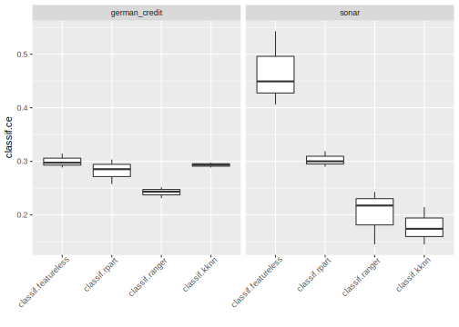
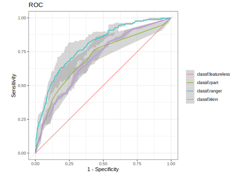

## Benchmarking {#benchmarking}

Comparing the performance of different learners on multiple tasks and/or different resampling schemes is a common task.
This operation is usually referred to as "benchmarking" in the field of machine-learning.
The [mlr3](https://mlr3.mlr-org.com) package offers the [`benchmark()`](https://mlr3.mlr-org.com/reference/benchmark.html) convenience function.

### Design Creation {#bm-design}

In mlr3 we require you to supply a "design" of your benchmark experiment.
A "design" is essentially a matrix of settings you want to execute.
It consists of unique combinations of [`Task`](https://mlr3.mlr-org.com/reference/Task.html), [`Learner`](https://mlr3.mlr-org.com/reference/Learner.html) and [`Resampling`](https://mlr3.mlr-org.com/reference/Resampling.html) triplets.

Here, we call [`benchmark()`](https://mlr3.mlr-org.com/reference/benchmark.html) to perform a single holdout split on a single task and two learners.
We use the [`benchmark_grid()`](https://mlr3.mlr-org.com/reference/benchmark_grid.html) function to create an exhaustive design and instantiate the resampling properly, so that all learners are executed on the same train/test split for each task:


```r
library("data.table")
library("mlr3")
design = benchmark_grid(
  tasks = tsk("iris"),
  learners = list(lrn("classif.rpart"), lrn("classif.featureless")),
  resamplings = rsmp("holdout")
)
print(design)
```

```
##                 task                         learner              resampling
## 1: <TaskClassif[45]>       <LearnerClassifRpart[33]> <ResamplingHoldout[19]>
## 2: <TaskClassif[45]> <LearnerClassifFeatureless[33]> <ResamplingHoldout[19]>
```

```r
bmr = benchmark(design)
```

Instead of using [`benchmark_grid()`](https://mlr3.mlr-org.com/reference/benchmark_grid.html) you could also create the design manually as a `data.table` and use the full flexibility of the [`benchmark()`](https://mlr3.mlr-org.com/reference/benchmark.html) function.
The design does not have to be exhaustive, e.g. it can also contain a different learner for each task.
However, you should note that [`benchmark_grid()`](https://mlr3.mlr-org.com/reference/benchmark_grid.html) makes sure to instantiate the resamplings for each task.
If you create the design manually, even if the same task is used multiple times, the train/test splits will be different for each row of the design if you do not [**manually instantiate**](#resampling-inst) the resampling before creating the design.


Let's construct a more complex design to show the full capabilities of the [`benchmark()`](https://mlr3.mlr-org.com/reference/benchmark.html) function.


```r
# get some example tasks
tasks = lapply(c("german_credit", "sonar"), tsk)

# get some learners and for all learners ...
# * predict probabilities
# * predict also on the training set
library("mlr3learners")
learners = c("classif.featureless", "classif.rpart", "classif.ranger", "classif.kknn")
learners = lapply(learners, lrn,
  predict_type = "prob", predict_sets = c("train", "test"))

# compare via 3-fold cross validation
resamplings = rsmp("cv", folds = 3)

# create a BenchmarkDesign object
design = benchmark_grid(tasks, learners, resamplings)
print(design)
```

```
##                 task                         learner         resampling
## 1: <TaskClassif[45]> <LearnerClassifFeatureless[33]> <ResamplingCV[19]>
## 2: <TaskClassif[45]>       <LearnerClassifRpart[33]> <ResamplingCV[19]>
## 3: <TaskClassif[45]>      <LearnerClassifRanger[33]> <ResamplingCV[19]>
## 4: <TaskClassif[45]>        <LearnerClassifKKNN[31]> <ResamplingCV[19]>
## 5: <TaskClassif[45]> <LearnerClassifFeatureless[33]> <ResamplingCV[19]>
## 6: <TaskClassif[45]>       <LearnerClassifRpart[33]> <ResamplingCV[19]>
## 7: <TaskClassif[45]>      <LearnerClassifRanger[33]> <ResamplingCV[19]>
## 8: <TaskClassif[45]>        <LearnerClassifKKNN[31]> <ResamplingCV[19]>
```

### Execution and Aggregation of Results {#bm-exec}

After the [benchmark design](#bm-design) is ready, we can directly call [`benchmark()`](https://mlr3.mlr-org.com/reference/benchmark.html):


```r
# execute the benchmark
bmr = benchmark(design)
```

Note that we did not instantiate the resampling instance manually.
[`benchmark_grid()`](https://mlr3.mlr-org.com/reference/benchmark_grid.html) took care of it for us:
Each resampling strategy is instantiated once for each task during the construction of the exhaustive grid.

Once the benchmarking is done, we can aggregate the performance with `$aggregate()`:


```r
# measures:
# * area under the curve (auc) on training
# * area under the curve (auc) on test
measures = list(
  msr("classif.auc", id = "auc_train", predict_sets = "train"),
  msr("classif.auc", id = "auc_test")
)
bmr$aggregate(measures)
```

```
##    nr      resample_result       task_id          learner_id resampling_id
## 1:  1 <ResampleResult[21]> german_credit classif.featureless            cv
## 2:  2 <ResampleResult[21]> german_credit       classif.rpart            cv
## 3:  3 <ResampleResult[21]> german_credit      classif.ranger            cv
## 4:  4 <ResampleResult[21]> german_credit        classif.kknn            cv
## 5:  5 <ResampleResult[21]>         sonar classif.featureless            cv
## 6:  6 <ResampleResult[21]>         sonar       classif.rpart            cv
## 7:  7 <ResampleResult[21]>         sonar      classif.ranger            cv
## 8:  8 <ResampleResult[21]>         sonar        classif.kknn            cv
##    iters auc_train auc_test
## 1:     3    0.5000   0.5000
## 2:     3    0.8042   0.7011
## 3:     3    0.9987   0.7959
## 4:     3    0.9873   0.6936
## 5:     3    0.5000   0.5000
## 6:     3    0.9243   0.7817
## 7:     3    1.0000   0.9342
## 8:     3    0.9987   0.9278
```

We can aggregate the results even further.
For example, we might be interested to know which learner performed best over all tasks simultaneously.
Simply aggregating the performances with the mean is usually not statistically sound.
Instead, we calculate the rank statistic for each learner grouped by task.
Then the calculated ranks grouped by learner are aggregated with [data.table](https://cran.r-project.org/package=data.table).
Since the AUC needs to be maximized, we multiply the values by $-1$ so that the best learner has a rank of $1$.


```r
tab = bmr$aggregate(measures)
print(tab)
```

```
##    nr      resample_result       task_id          learner_id resampling_id
## 1:  1 <ResampleResult[21]> german_credit classif.featureless            cv
## 2:  2 <ResampleResult[21]> german_credit       classif.rpart            cv
## 3:  3 <ResampleResult[21]> german_credit      classif.ranger            cv
## 4:  4 <ResampleResult[21]> german_credit        classif.kknn            cv
## 5:  5 <ResampleResult[21]>         sonar classif.featureless            cv
## 6:  6 <ResampleResult[21]>         sonar       classif.rpart            cv
## 7:  7 <ResampleResult[21]>         sonar      classif.ranger            cv
## 8:  8 <ResampleResult[21]>         sonar        classif.kknn            cv
##    iters auc_train auc_test
## 1:     3    0.5000   0.5000
## 2:     3    0.8042   0.7011
## 3:     3    0.9987   0.7959
## 4:     3    0.9873   0.6936
## 5:     3    0.5000   0.5000
## 6:     3    0.9243   0.7817
## 7:     3    1.0000   0.9342
## 8:     3    0.9987   0.9278
```

```r
# group by levels of task_id, return columns:
# - learner_id
# - rank of col '-auc_train' (per level of learner_id)
# - rank of col '-auc_test' (per level of learner_id)
ranks = tab[, .(learner_id, rank_train = rank(-auc_train), rank_test = rank(-auc_test)), by = task_id]
print(ranks)
```

```
##          task_id          learner_id rank_train rank_test
## 1: german_credit classif.featureless          4         4
## 2: german_credit       classif.rpart          3         2
## 3: german_credit      classif.ranger          1         1
## 4: german_credit        classif.kknn          2         3
## 5:         sonar classif.featureless          4         4
## 6:         sonar       classif.rpart          3         3
## 7:         sonar      classif.ranger          1         1
## 8:         sonar        classif.kknn          2         2
```

```r
# group by levels of learner_id, return columns:
# - mean rank of col 'rank_train' (per level of learner_id)
# - mean rank of col 'rank_test' (per level of learner_id)
ranks = ranks[, .(mrank_train = mean(rank_train), mrank_test = mean(rank_test)), by = learner_id]

# print the final table, ordered by mean rank of AUC test
ranks[order(mrank_test)]
```

```
##             learner_id mrank_train mrank_test
## 1:      classif.ranger           1        1.0
## 2:       classif.rpart           3        2.5
## 3:        classif.kknn           2        2.5
## 4: classif.featureless           4        4.0
```

Unsurprisingly, the featureless learner is outperformed on both training and test set.


### Plotting Benchmark Results {#autoplot-benchmarkresult}

Analogously to plotting [tasks](#autoplot-task), [predictions](#autoplot-prediction) or [resample results](#autoplot-resampleresult), [mlr3viz](https://mlr3viz.mlr-org.com) also provides a [`autoplot()`](https://www.rdocumentation.org/packages/ggplot2/topics/autoplot) method for benchmark results.


```r
library("mlr3viz")
library("ggplot2")

autoplot(bmr) + theme(axis.text.x = element_text(angle = 45, hjust = 1))
```



We can also plot ROC curves.
To do so, we first need to filter the [`BenchmarkResult`](https://mlr3.mlr-org.com/reference/BenchmarkResult.html) to only contain a single [`Task`](https://mlr3.mlr-org.com/reference/Task.html):


```r
autoplot(bmr$clone()$filter(task_id = "german_credit"), type = "roc")
```



All available types are listed on the manual page of [`autoplot.BenchmarkResult()`](https://mlr3viz.mlr-org.com/reference/autoplot.BenchmarkResult.html).

### Extracting ResampleResults {#bm-resamp}

A [`BenchmarkResult`](https://mlr3.mlr-org.com/reference/BenchmarkResult.html) object is essentially a collection of multiple [`ResampleResult`](https://mlr3.mlr-org.com/reference/ResampleResult.html) objects.
As these are stored in a column of the aggregated `data.table()`, we can easily extract them:


```r
tab = bmr$aggregate(measures)
rr = tab[task_id == "german_credit" & learner_id == "classif.ranger"]$resample_result[[1]]
print(rr)
```

```
## <ResampleResult> of 3 iterations
## * Task: german_credit
## * Learner: classif.ranger
## * Warnings: 0 in 0 iterations
## * Errors: 0 in 0 iterations
```

We can now investigate this resampling and even single resampling iterations using one of the approaches shown in [the previous section](#bm-exec):


```r
measure = msr("classif.auc")
rr$aggregate(measure)
```

```
## classif.auc 
##      0.7959
```

```r
# get the iteration with worst AUC
perf = rr$score(measure)
i = which.min(perf$classif.auc)

# get the corresponding learner and train set
print(rr$learners[[i]])
```

```
## <LearnerClassifRanger:classif.ranger>
## * Model: -
## * Parameters: list()
## * Packages: ranger
## * Predict Type: prob
## * Feature types: logical, integer, numeric, character, factor, ordered
## * Properties: importance, multiclass, oob_error, twoclass, weights
```

```r
head(rr$resampling$train_set(i))
```

```
## [1]  2  5  9 10 14 17
```

### Converting and Merging ResampleResults

It is also possible to cast a single [`ResampleResult`](https://mlr3.mlr-org.com/reference/ResampleResult.html) to a [`BenchmarkResult`](https://mlr3.mlr-org.com/reference/BenchmarkResult.html) using the converter [`as_benchmark_result()`](https://mlr3.mlr-org.com/reference/as_benchmark_result.html).


```r
task = tsk("iris")
resampling = rsmp("holdout")$instantiate(task)

rr1 = resample(task, lrn("classif.rpart"), resampling)
rr2 = resample(task, lrn("classif.featureless"), resampling)

# Cast both ResampleResults to BenchmarkResults
bmr1 = as_benchmark_result(rr1)
bmr2 = as_benchmark_result(rr2)

# Merge 2nd BMR into the first BMR
bmr1$combine(bmr2)

bmr1
```

```
## <BenchmarkResult> of 2 rows with 2 resampling runs
##  nr task_id          learner_id resampling_id iters warnings errors
##   1    iris       classif.rpart       holdout     1        0      0
##   2    iris classif.featureless       holdout     1        0      0
```
