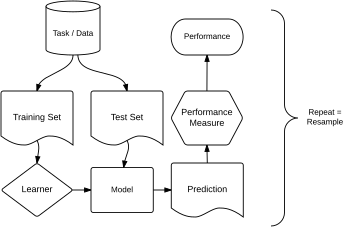
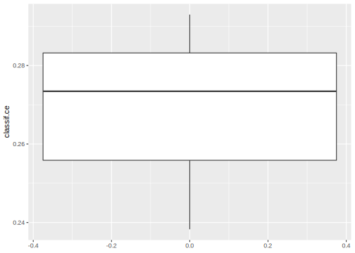
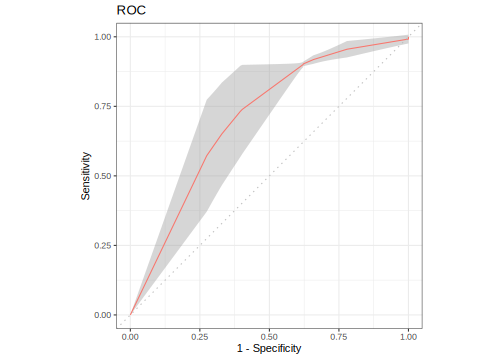

## Resampling {#resampling}

Resampling strategies are usually used to assess the performance of a learning algorithm.
`mlr3` entails the following predefined [resampling](#resampling) strategies:
[`cross validation`](https://mlr3.mlr-org.com/reference/mlr_resamplings_cv.html) (`"cv"`),
[`leave-one-out cross validation`](https://mlr3.mlr-org.com/reference/mlr_resamplings_loo.html) (`"loo"`),
[`repeated cross validation`](https://mlr3.mlr-org.com/reference/mlr_resamplings_repeated_cv.html) (`"repeated_cv"`),
[`bootstrapping`](https://mlr3.mlr-org.com/reference/mlr_resamplings_bootstrap.html) (`"bootstrap"`),
[`subsampling`](https://mlr3.mlr-org.com/reference/mlr_resamplings_subsampling.html) (`"subsampling"`),
[`holdout`](https://mlr3.mlr-org.com/reference/mlr_resamplings_holdout.html) (`"holdout"`),
[`in-sample resampling`](https://mlr3.mlr-org.com/reference/mlr_resamplings_insample.html) (`"insample"`), and
[`custom resampling`](https://mlr3.mlr-org.com/reference/mlr_resamplings_custom.html) (`"custom"`).
The following sections provide guidance on how to set and select a resampling strategy and how to subsequently instantiate the resampling process.

Below you can find a graphical illustration of the resampling process:



### Settings {#resampling-settings}

In this example we use the **iris** task and a simple classification tree from the [rpart](https://cran.r-project.org/package=rpart) package.


```r
task = tsk("iris")
learner = lrn("classif.rpart")
```

When performing resampling with a dataset, we first need to define which approach should be used.
[mlr3](https://mlr3.mlr-org.com) resampling strategies and their parameters can be queried by looking at the data.table output of the `mlr_resamplings` dictionary:


```r
as.data.table(mlr_resamplings)
```

```
##            key        params iters
## 1:   bootstrap repeats,ratio    30
## 2:      custom                   0
## 3:          cv         folds    10
## 4:     holdout         ratio     1
## 5:    insample                   1
## 6:         loo                  NA
## 7: repeated_cv repeats,folds   100
## 8: subsampling repeats,ratio    30
```

Additional resampling methods for special use cases will be available via extension packages, such as [mlr3spatiotemporal](https://github.com/mlr-org/mlr3spatiotemporal) for spatial data (still in development).

The model fit conducted in the [train/predict/score](#train-predict) chapter is equivalent to a "holdout resampling", so let's consider this one first.
Again, we can retrieve elements from the dictionary [`mlr_resamplings`](https://mlr3.mlr-org.com/reference/mlr_resamplings.html) via `$get()` or with the convenience function[`rsmp()`](https://mlr3.mlr-org.com/reference/mlr_sugar.html):


```r
resampling = rsmp("holdout")
print(resampling)
```

```
## <ResamplingHoldout> with 1 iterations
## * Instantiated: FALSE
## * Parameters: ratio=0.6667
```

Note that the `$is_instantiated` field is set to `FALSE`.
This means we did not actually apply the strategy on a dataset yet.
Applying the strategy on a dataset is done in the next section [Instantiation](#instantiation).

By default we get a .66/.33 split of the data.
There are two ways in which the ratio can be changed:

1. Overwriting the slot in `$param_set$values` using a named list:


```r
resampling$param_set$values = list(ratio = 0.8)
```

2. Specifying the resampling parameters directly during construction:


```r
rsmp("holdout", ratio = 0.8)
```

```
## <ResamplingHoldout> with 1 iterations
## * Instantiated: FALSE
## * Parameters: ratio=0.8
```

### Instantiation {#resampling-inst}

So far we just set the stage and selected the resampling strategy.

To actually perform the splitting and obtain indices for the training and the test split the resampling needs a [`Task`](https://mlr3.mlr-org.com/reference/Task.html).
By calling the method `instantiate()`, we split the indices of the data into indices for training and test sets.
These resulting indices are stored in the [`Resampling`](https://mlr3.mlr-org.com/reference/Resampling.html) object:


```r
resampling = rsmp("cv", folds = 3L)
resampling$instantiate(task)
resampling$iters
```

```
## [1] 3
```

```r
str(resampling$train_set(1))
```

```
##  int [1:100] 4 5 9 18 21 26 27 28 29 30 ...
```

```r
str(resampling$test_set(1))
```

```
##  int [1:50] 2 7 8 10 11 17 19 23 25 33 ...
```

### Execution {#resampling-exec}

With a [`Task`](https://mlr3.mlr-org.com/reference/Task.html), a [`Learner`](https://mlr3.mlr-org.com/reference/Learner.html) and a [`Resampling`](https://mlr3.mlr-org.com/reference/Resampling.html) object we can call [`resample()`](https://mlr3.mlr-org.com/reference/resample.html), which fits the learner to the task at hand according to the given resampling strategy.
This in turn creates a [`ResampleResult`](https://mlr3.mlr-org.com/reference/ResampleResult.html) object.

Before we go into more detail, let's change the resampling to a "3-fold cross-validation" to better illustrate what operations are possible with a [`ResampleResult`](https://mlr3.mlr-org.com/reference/ResampleResult.html).
Additionally, when actually fitting the models, we tell [`resample()`](https://mlr3.mlr-org.com/reference/resample.html) to keep the fitted models by setting the `store_models` option to `TRUE`:


```r
task = tsk("pima")
learner = lrn("classif.rpart", maxdepth = 3, predict_type = "prob")
resampling = rsmp("cv", folds = 3L)

rr = resample(task, learner, resampling, store_models = TRUE)
print(rr)
```

```
## <ResampleResult> of 3 iterations
## * Task: pima
## * Learner: classif.rpart
## * Warnings: 0 in 0 iterations
## * Errors: 0 in 0 iterations
```

The following operations are supported with [`ResampleResult`](https://mlr3.mlr-org.com/reference/ResampleResult.html) objects:

Calculate the average performance across all resampling iterations:


```r
rr$aggregate(msr("classif.ce"))
```

```
## classif.ce 
##     0.2682
```

Extract the performance for the individual resampling iterations:


```r
rr$score(msr("classif.ce"))
```

```
##                 task task_id                   learner    learner_id
## 1: <TaskClassif[45]>    pima <LearnerClassifRpart[33]> classif.rpart
## 2: <TaskClassif[45]>    pima <LearnerClassifRpart[33]> classif.rpart
## 3: <TaskClassif[45]>    pima <LearnerClassifRpart[33]> classif.rpart
##            resampling resampling_id iteration              prediction
## 1: <ResamplingCV[19]>            cv         1 <PredictionClassif[19]>
## 2: <ResamplingCV[19]>            cv         2 <PredictionClassif[19]>
## 3: <ResamplingCV[19]>            cv         3 <PredictionClassif[19]>
##    classif.ce
## 1:     0.2734
## 2:     0.2383
## 3:     0.2930
```

Check for warnings or errors:


```r
rr$warnings
```

```
## Empty data.table (0 rows and 2 cols): iteration,msg
```

```r
rr$errors
```

```
## Empty data.table (0 rows and 2 cols): iteration,msg
```

Extract and inspect the resampling splits:


```r
rr$resampling
```

```
## <ResamplingCV> with 3 iterations
## * Instantiated: TRUE
## * Parameters: folds=3
```

```r
rr$resampling$iters
```

```
## [1] 3
```

```r
str(rr$resampling$test_set(1))
```

```
##  int [1:256] 1 5 7 12 13 15 17 19 21 23 ...
```

```r
str(rr$resampling$train_set(1))
```

```
##  int [1:512] 4 6 11 14 16 22 27 30 31 36 ...
```

Retrieve the [learner](#learners) of a specific iteration and inspect it:


```r
lrn = rr$learners[[1]]
lrn$model
```

```
## n= 512 
## 
## node), split, n, loss, yval, (yprob)
##       * denotes terminal node
## 
##  1) root 512 186 neg (0.3633 0.6367)  
##    2) glucose>=123.5 212  79 pos (0.6274 0.3726)  
##      4) glucose>=154.5 82  12 pos (0.8537 0.1463) *
##      5) glucose< 154.5 130  63 neg (0.4846 0.5154)  
##       10) mass>=30.3 82  31 pos (0.6220 0.3780) *
##       11) mass< 30.3 48  12 neg (0.2500 0.7500) *
##    3) glucose< 123.5 300  53 neg (0.1767 0.8233) *
```

Extract the predictions:


```r
rr$prediction() # all predictions merged into a single Prediction
```

```
## <PredictionClassif> for 768 observations:
##     row_id truth response prob.pos prob.neg
##          1   pos      pos   0.6220   0.3780
##          5   pos      pos   0.6220   0.3780
##          7   pos      neg   0.1767   0.8233
## ---                                        
##        761   neg      neg   0.2134   0.7866
##        764   neg      neg   0.2134   0.7866
##        765   neg      neg   0.2134   0.7866
```

```r
rr$predictions()[[1]] # prediction of first resampling iteration
```

```
## <PredictionClassif> for 256 observations:
##     row_id truth response prob.pos prob.neg
##          1   pos      pos   0.6220   0.3780
##          5   pos      pos   0.6220   0.3780
##          7   pos      neg   0.1767   0.8233
## ---                                        
##        760   pos      pos   0.8537   0.1463
##        767   pos      neg   0.2500   0.7500
##        768   neg      neg   0.1767   0.8233
```

Note that if you want to compare multiple [Learners](#learners) in a fair manner, it is important to ensure that each learner operates on the same resampling instance.
This can be achieved by manually instantiating the instance before fitting model(s) on it.

Hint: If your aim is to compare different [`Task`](https://mlr3.mlr-org.com/reference/Task.html), [`Learner`](https://mlr3.mlr-org.com/reference/Learner.html) or [`Resampling`](https://mlr3.mlr-org.com/reference/Resampling.html), you are better off using the [`benchmark()`](https://mlr3.mlr-org.com/reference/benchmark.html) function which is covered in the [next section on benchmarking](#benchmarking).
It is a wrapper around [`resample()`](https://mlr3.mlr-org.com/reference/resample.html), simplifying the handling of large comparison grids.

If you discover this only after you've run multiple [`resample()`](https://mlr3.mlr-org.com/reference/resample.html) calls, don't worry.
You can combine multiple [`ResampleResult`](https://mlr3.mlr-org.com/reference/ResampleResult.html) objects into a [`BenchmarkResult`](https://mlr3.mlr-org.com/reference/BenchmarkResult.html) (also explained in the [section benchmarking](#benchmarking)).

### Custom resampling {#resamp-custom}

Sometimes it is necessary to perform resampling with custom splits.
If you want to do that because you are coming from a specific modeling field, first take a look at the mlr3 extension packages, to check wheter your resampling method has been implemented already.
If this is not the case, feel welcome to extend an existing package or create your own extension package.

A manual resampling instance can be created using the `"custom"` template.


```r
resampling = rsmp("custom")
resampling$instantiate(task,
  train = list(c(1:10, 51:60, 101:110)),
  test = list(c(11:20, 61:70, 111:120))
)
resampling$iters
```

```
## [1] 1
```

```r
resampling$train_set(1)
```

```
##  [1]   1   2   3   4   5   6   7   8   9  10  51  52  53  54  55  56  57  58  59
## [20]  60 101 102 103 104 105 106 107 108 109 110
```

```r
resampling$test_set(1)
```

```
##  [1]  11  12  13  14  15  16  17  18  19  20  61  62  63  64  65  66  67  68  69
## [20]  70 111 112 113 114 115 116 117 118 119 120
```

### Plotting Resample Results {#autoplot-resampleresult}

Again, [mlr3viz](https://mlr3viz.mlr-org.com) provides a [`autoplot()`](https://www.rdocumentation.org/packages/ggplot2/topics/autoplot) method.


```r
library("mlr3viz")

autoplot(rr)
```



```r
autoplot(rr, type = "roc")
```



All available plot types are listed on the manual page of [`autoplot.ResampleResult()`](https://mlr3viz.mlr-org.com/reference/autoplot.ResampleResult.html).
