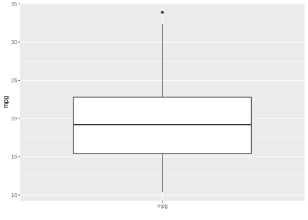

## Tasks {#tasks}

Tasks are objects that contain the data and additional meta-data for a machine learning problem.
The meta-data is, for example, the name of the target variable (the prediction) for supervised machine learning problems, or the type of the dataset (e.g. a _spatial_ or _survival_).
This information is used for specific operations that can be performed on a task.

### Task Types {#tasks-types}

To create a task from a [`data.frame()`](https://www.rdocumentation.org/packages/base/topics/data.frame) or [`data.table()`](https://www.rdocumentation.org/packages/data.table/topics/data.table-package) object, the task type needs to be specified:

**Classification Task**: The target is a label (stored as `character()`or`factor()`) with only few distinct values.
<br/>→ [`mlr3::TaskClassif`](https://mlr3.mlr-org.com/reference/TaskClassif.html)

**Regression Task**: The target is a numeric quantity (stored as `integer()` or `double()`).
<br/>→ [`mlr3::TaskRegr`](https://mlr3.mlr-org.com/reference/TaskRegr.html)

**Survival Task**: The target is the (right-censored) time to an event.
<br/>→ [`mlr3proba::TaskSurv`](https://mlr3proba.mlr-org.com/reference/TaskSurv.html) in add-on package [mlr3proba](https://mlr3proba.mlr-org.com)

**Ordinal Regression Task**: The target is ordinal.
<br/>→ `TaskOrdinal` in add-on package [mlr3ordinal](https://github.com/mlr-org/mlr3ordinal)

**Cluster Task**: An unsupervised task type; there is no target and the aim is to identify similar groups within the feature space.
<br/>→ Not yet implemented

**Spatial Task**: Observations in the task have spatio-temporal information (e.g. coordinates).
<br/>→ Not yet implemented, but started in add-on package [mlr3spatiotemporal](https://mlr3spatiotemporal.mlr-org.com)

### Task Creation {#tasks-creation}

As an example, we will create a regression task using the `mtcars` data set from the package `datasets` and predict the target `"mpg"` (miles per gallon).
We only consider the first two features in the dataset for brevity.

First, we load and prepare the data.


```r
data("mtcars", package = "datasets")
data = mtcars[, 1:3]
str(data)
```

```
## 'data.frame':	32 obs. of  3 variables:
##  $ mpg : num  21 21 22.8 21.4 18.7 18.1 14.3 24.4 22.8 19.2 ...
##  $ cyl : num  6 6 4 6 8 6 8 4 4 6 ...
##  $ disp: num  160 160 108 258 360 ...
```

Next, we create the task using the constructor for a regression task object (`TaskRegr$new`) and give the following information:

1. `id`: An arbitrary identifier for the task, used in plots and summaries.
2. `backend`: This parameter allows fine-grained control over how data is accessed.
   Here, we simply provide the dataset which is automatically converted to a [`DataBackendDataTable`](https://mlr3.mlr-org.com/reference/DataBackendDataTable.html).
   Alternatively, we could also construct a [`DataBackend`](https://mlr3.mlr-org.com/reference/DataBackend.html) manually.
3. `target`: The name of the target column for the regression problem.


```r
library("mlr3")

task_mtcars = TaskRegr$new(id = "cars", backend = data, target = "mpg")
print(task_mtcars)
```

```
## <TaskRegr:cars> (32 x 3)
## * Target: mpg
## * Properties: -
## * Features (2):
##   - dbl (2): cyl, disp
```

The `print()` method gives a short summary of the task:
It has 32 observations and 3 columns, of which 2 are features.

We can also plot the task using the [mlr3viz](https://mlr3viz.mlr-org.com) package, which gives a graphical summary of its properties:


```r
library("mlr3viz")
autoplot(task_mtcars, type = "pairs")
```

```
## Registered S3 method overwritten by 'GGally':
##   method from   
##   +.gg   ggplot2
```


### Predefined tasks {#tasks-predefined}

[mlr3](https://mlr3.mlr-org.com) ships with a few predefined machine learning tasks.
All tasks are stored in an R6 [`Dictionary`](https://mlr3misc.mlr-org.com/reference/Dictionary.html) (a key-value store) named [`mlr_tasks`](https://mlr3.mlr-org.com/reference/mlr_tasks.html).
Printing it gives the keys (the names of the datasets):


```r
mlr_tasks
```

```
## <DictionaryTask> with 10 stored values
## Keys: boston_housing, breast_cancer, german_credit, iris, mtcars, pima,
##   sonar, spam, wine, zoo
```

We can get a more informative summary of the example tasks by converting the dictionary to a `data.table()` object:


```r
library("data.table")
as.data.table(mlr_tasks)
```

```
##                key task_type nrow ncol lgl int dbl chr fct ord pxc
##  1: boston_housing      regr  506   19   0   3  13   0   2   0   0
##  2:  breast_cancer   classif  683   10   0   0   0   0   0   9   0
##  3:  german_credit   classif 1000   21   0   3   0   0  14   3   0
##  4:           iris   classif  150    5   0   0   4   0   0   0   0
##  5:         mtcars      regr   32   11   0   0  10   0   0   0   0
##  6:           pima   classif  768    9   0   0   8   0   0   0   0
##  7:          sonar   classif  208   61   0   0  60   0   0   0   0
##  8:           spam   classif 4601   58   0   0  57   0   0   0   0
##  9:           wine   classif  178   14   0   2  11   0   0   0   0
## 10:            zoo   classif  101   17  15   1   0   0   0   0   0
```
In the above display, the columns "lgl" (logical), "int" (integer), "dbl" (double), "chr" (character), "fct" (factor) and "ord" (ordinal) display the number of features (or columns) in the dataset with the corresponding datatype.

To get a task from the dictionary, one can use the `$get()` method from the `mlr_tasks` class and assign the return value to a new object.
For example, to use the [iris data set](https://en.wikipedia.org/wiki/Iris_flower_data_set) for classification:


```r
task_iris = mlr_tasks$get("iris")
print(task_iris)
```

```
## <TaskClassif:iris> (150 x 5)
## * Target: Species
## * Properties: multiclass
## * Features (4):
##   - dbl (4): Petal.Length, Petal.Width, Sepal.Length, Sepal.Width
```

Alternatively, you can also use the convenience function [`tsk()`](https://mlr3.mlr-org.com/reference/mlr_sugar.html), which also constructs a task from the dictionary.


```r
tsk("iris")
```

```
## <TaskClassif:iris> (150 x 5)
## * Target: Species
## * Properties: multiclass
## * Features (4):
##   - dbl (4): Petal.Length, Petal.Width, Sepal.Length, Sepal.Width
```

### Task API {#tasks-api}

All task properties and characteristics can be queried using the task's public fields and methods (see [`Task`](https://mlr3.mlr-org.com/reference/Task.html)).
Methods are also used to change the behavior of the task.

#### Retrieving Data {#tasks-retrieving}

The data stored in a task can be retrieved directly from fields, for example:


```r
task_iris$nrow
```

```
## [1] 150
```

```r
task_iris$ncol
```

```
## [1] 5
```

More information can be obtained through methods of the object, for example:


```r
task_iris$data()
```

```
##        Species Petal.Length Petal.Width Sepal.Length Sepal.Width
##   1:    setosa          1.4         0.2          5.1         3.5
##   2:    setosa          1.4         0.2          4.9         3.0
##   3:    setosa          1.3         0.2          4.7         3.2
##   4:    setosa          1.5         0.2          4.6         3.1
##   5:    setosa          1.4         0.2          5.0         3.6
##  ---                                                            
## 146: virginica          5.2         2.3          6.7         3.0
## 147: virginica          5.0         1.9          6.3         2.5
## 148: virginica          5.2         2.0          6.5         3.0
## 149: virginica          5.4         2.3          6.2         3.4
## 150: virginica          5.1         1.8          5.9         3.0
```

In [mlr3](https://mlr3.mlr-org.com), each row (observation) has a unique identifier, stored as an `integer()`.
These can be passed as arguments to the `$data()` method to select specific rows:


```r
head(task_iris$row_ids)
```

```
## [1] 1 2 3 4 5 6
```

```r
# retrieve data for rows with ids 1, 51, and 101
task_iris$data(rows = c(1, 51, 101))
```

```
##       Species Petal.Length Petal.Width Sepal.Length Sepal.Width
## 1:     setosa          1.4         0.2          5.1         3.5
## 2: versicolor          4.7         1.4          7.0         3.2
## 3:  virginica          6.0         2.5          6.3         3.3
```

Similarly, target and feature columns also have unique identifiers, i.e. names.
These names are stored in the public slots `$feature_names` and `$target_names`.
Here "target" refers to the variable we want to predict and "feature" to the predictors for the task.


```r
task_iris$feature_names
```

```
## [1] "Petal.Length" "Petal.Width"  "Sepal.Length" "Sepal.Width"
```

```r
task_iris$target_names
```

```
## [1] "Species"
```

The `row_ids` and column names can be combined when selecting a subset of the data:


```r
# retrieve data for rows 1, 51, and 101 and only select column "Species"
task_iris$data(rows = c(1, 51, 101), cols = "Species")
```

```
##       Species
## 1:     setosa
## 2: versicolor
## 3:  virginica
```

To extract the complete data from the task, one can simply convert it to a `data.table`:


```r
summary(as.data.table(task_iris))
```

```
##        Species    Petal.Length   Petal.Width   Sepal.Length   Sepal.Width  
##  setosa    :50   Min.   :1.00   Min.   :0.1   Min.   :4.30   Min.   :2.00  
##  versicolor:50   1st Qu.:1.60   1st Qu.:0.3   1st Qu.:5.10   1st Qu.:2.80  
##  virginica :50   Median :4.35   Median :1.3   Median :5.80   Median :3.00  
##                  Mean   :3.76   Mean   :1.2   Mean   :5.84   Mean   :3.06  
##                  3rd Qu.:5.10   3rd Qu.:1.8   3rd Qu.:6.40   3rd Qu.:3.30  
##                  Max.   :6.90   Max.   :2.5   Max.   :7.90   Max.   :4.40
```

#### Roles (Rows and Columns) {#tasks-roles}

It is possible to assign roles to rows and columns.
These roles affect the behavior of the task for different operations.
Furthermore, these roles provide additional meta-data for it.

For example, the previously-constructed _mtcars_ task has the following column roles:


```r
print(task_mtcars$col_roles)
```

```
## $feature
## [1] "cyl"  "disp"
## 
## $target
## [1] "mpg"
## 
## $name
## character(0)
## 
## $order
## character(0)
## 
## $stratum
## character(0)
## 
## $group
## character(0)
## 
## $weight
## character(0)
```

To add the row names of `mtcars` as an additional feature, we first add them to the data table and then recreate the task.


```r
# with `keep.rownames`, data.table stores the row names in an extra column "rn"
data = as.data.table(mtcars[, 1:3], keep.rownames = TRUE)
task = TaskRegr$new(id = "cars", backend = data, target = "mpg")

# there is a new feature called "rn"
task$feature_names
```

```
## [1] "cyl"  "disp" "rn"
```

The row names are now a feature whose values are stored in the column `"rn"`.
We include this column here for educational purposes only.
Generally speaking, there is no point in having a feature that uniquely identifies each row.
Furthermore, the character data type will cause problems with many types of machine learning algorithms.
On the other hand, the identifier may be useful to label points in plots and identify outliers.
To use the new column in the current example, we will change the role of the `"rn"` column and remove it from the set of active features.
This is done by simply modifying the field `$col_roles`, which is a named list of vectors of column names.
Each vector in this list corresponds to a column role, and the column names contained in that vector are designated as having that role.
Supported column roles can be found in the manual of [`Task`](https://mlr3.mlr-org.com/reference/Task.html).


```r
# supported column roles, see ?Task
names(task$col_roles)
```

```
## [1] "feature" "target"  "name"    "order"   "stratum" "group"   "weight"
```

```r
# assign column "rn" the role "name"
task$col_roles$name = "rn"

# remove "rn" from role "feature"
task$col_roles$feature = setdiff(task$col_roles$feature, "rn")

# "rn" not listed as feature anymore
task$feature_names
```

```
## [1] "cyl"  "disp"
```

```r
# "rn" also does not appear anymore when we access the data
task$data(rows = 1:2)
```

```
##    mpg cyl disp
## 1:  21   6  160
## 2:  21   6  160
```

```r
task$head(2)
```

```
##    mpg cyl disp
## 1:  21   6  160
## 2:  21   6  160
```

Changing the role does not change the underlying data.
Changing the role only changes the view on it.
The data is not copied in the code above.
The view is changed in-place though, i.e. the task object itself is modified.

Just like columns, it is also possible to assign different roles to rows.

Rows can have two different roles:

1. Role `use`:
Rows that are generally available for model fitting (although they may also be used as test set in resampling).
This role is the default role.

2. Role `validation`:
Rows that are not used for training.
Rows that have missing values in the target column during task creation are automatically set to the validation role.

There are several reasons to hold some observations back or treat them differently:

1. It is often good practice to validate the final model on an external validation set to identify possible overfitting.
2. Some observations may be unlabeled, e.g. in competitions like [Kaggle](https://www.kaggle.com/).

These observations cannot be used for training a model, but can be used to get predictions.

#### Task Mutators {#tasks-mutators}

As shown above, modifying `$col_roles` or `$row_roles` changes the view on the data.
The additional convenience method `$filter()` subsets the current view based on row ids and `$select()` subsets the view based on feature names.


```r
task = tsk("iris")
task$select(c("Sepal.Width", "Sepal.Length")) # keep only these features
task$filter(1:3) # keep only these rows
task$head()
```

```
##    Species Sepal.Length Sepal.Width
## 1:  setosa          5.1         3.5
## 2:  setosa          4.9         3.0
## 3:  setosa          4.7         3.2
```

While the methods discussed above allow to subset the data, the methods `$rbind()` and `$cbind()` allow to add extra rows and columns to a task.
Again, the original data is not changed.
The additional rows or columns are only added to the view of the data.


```r
task$cbind(data.table(foo = letters[1:3])) # add column foo
task$head()
```

```
##    Species Sepal.Length Sepal.Width foo
## 1:  setosa          5.1         3.5   a
## 2:  setosa          4.9         3.0   b
## 3:  setosa          4.7         3.2   c
```

### Plotting Tasks {#autoplot-task}

The [mlr3viz](https://mlr3viz.mlr-org.com) package provides plotting facilities for many classes implemented in [mlr3](https://mlr3.mlr-org.com).
The available plot types depend on the inherited class, but all plots are returned as [ggplot2](https://cran.r-project.org/package=ggplot2) objects which can be easily customized.

For classification tasks (inheriting from [`TaskClassif`](https://mlr3.mlr-org.com/reference/TaskClassif.html)), see the documentation of [`mlr3viz::autoplot.TaskClassif`](https://mlr3viz.mlr-org.com/reference/autoplot.TaskClassif.html) for the implemented plot types.
Here are some examples to get an impression:


```r
library("mlr3viz")

# get the pima indians task
task = tsk("pima")

# subset task to only use the 3 first features
task$select(head(task$feature_names, 3))

# default plot: class frequencies
autoplot(task)
```


```r
# pairs plot (requires package GGally)
autoplot(task, type = "pairs")
```


```r
# duo plot (requires package GGally)
autoplot(task, type = "duo")
```


Of course, you can do the same for regression tasks (inheriting from [`TaskRegr`](https://mlr3.mlr-org.com/reference/TaskRegr.html)) as documented in [`mlr3viz::autoplot.TaskRegr`](https://mlr3viz.mlr-org.com/reference/autoplot.TaskRegr.html):


```r
library("mlr3viz")

# get the mtcars task
task = tsk("mtcars")

# subset task to only use the 3 first features
task$select(head(task$feature_names, 3))

# default plot: boxplot of target variable
autoplot(task)
```



```r
# pairs plot (requires package GGally)
autoplot(task, type = "pairs")
```


