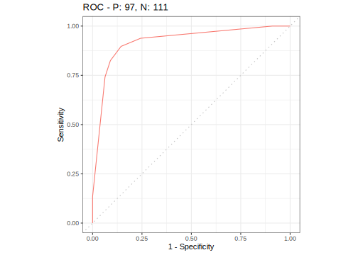

## Train and Predict {#train-predict}

In this section, we explain how [tasks](#tasks) and [learners](#learners) can be used to train a model and predict to a new dataset.
The concept is demonstrated on a supervised classification using the iris dataset and the **rpart** learner, which builds a singe classification tree.

Training a [learner](#learners) means fitting a model to a given data set.
Subsequently, we want to [predict](#predicting) the label for new observations.
These [predictions](#predicting) are compared to the ground truth values in order to assess the predictive performance of the model.

### Creating Task and Learner Objects {#train-predict-objects}

The first step is to generate the following [mlr3](https://mlr3.mlr-org.com) objects from the [task dictionary](#tasks) and the [learner dictionary](#learners), respectively:

1. The classification [task](#tasks):


```r
task = tsk("sonar")
```

2. A [learner](#learners) for the classification tree:


```r
learner = lrn("classif.rpart")
```

### Setting up the train/test splits of the data {#split-data}

It is common to train on a majority of the data.
Here we use 80% of all available observations and predict on the remaining 20%.
For this purpose, we create two index vectors:


```r
train_set = sample(task$nrow, 0.8 * task$nrow)
test_set = setdiff(seq_len(task$nrow), train_set)
```

In Section \@ref(resampling) we will learn how mlr3 can automatically create training and test sets based on different [resampling](#resampling) strategies.

### Training the learner {#training}

The field `$model` stores the model that is produced in the training step.
Before the `$train()` method is called on a learner object, this field is `NULL`:


```r
learner$model
```

```
## NULL
```

Next, the classification tree is trained using the train set of the iris task by calling the `$train()` method of the [`Learner`](https://mlr3.mlr-org.com/reference/Learner.html):


```r
learner$train(task, row_ids = train_set)
```

This operation modifies the learner in-place.
We can now access the stored model via the field `$model`:


```r
print(learner$model)
```

```
## n= 166 
## 
## node), split, n, loss, yval, (yprob)
##       * denotes terminal node
## 
## 1) root 166 76 M (0.54217 0.45783)  
##   2) V11>=0.1704 108 30 M (0.72222 0.27778)  
##     4) V52>=0.00675 91 18 M (0.80220 0.19780)  
##       8) V7< 0.2092 78 10 M (0.87179 0.12821) *
##       9) V7>=0.2092 13  5 R (0.38462 0.61538) *
##     5) V52< 0.00675 17  5 R (0.29412 0.70588) *
##   3) V11< 0.1704 58 12 R (0.20690 0.79310)  
##     6) V5>=0.0696 14  4 M (0.71429 0.28571) *
##     7) V5< 0.0696 44  2 R (0.04545 0.95455) *
```

### Predicting {#predicting}

After the model has been trained, we use the remaining part of the data for prediction.
Remember that we [initially split the data](#split-data) in `train_set` and `test_set`.


```r
prediction = learner$predict(task, row_ids = test_set)
print(prediction)
```

```
## <PredictionClassif> for 42 observations:
##     row_id truth response
##          7     R        M
##         17     R        M
##         26     R        R
## ---                      
##        190     M        M
##        193     M        M
##        197     M        M
```

The `$predict()` method of the [`Learner`](https://mlr3.mlr-org.com/reference/Learner.html) returns a [`Prediction`](https://mlr3.mlr-org.com/reference/Prediction.html) object.
More precisely, a [`LearnerClassif`](https://mlr3.mlr-org.com/reference/LearnerClassif.html) returns a [`PredictionClassif`](https://mlr3.mlr-org.com/reference/PredictionClassif.html) object.

A prediction objects holds the row ids of the test data, the respective true label of the target column and the respective predictions.
The simplest way to extract this information is by converting the [`Prediction`](https://mlr3.mlr-org.com/reference/Prediction.html) object to a `data.table()`:


```r
head(as.data.table(prediction))
```

```
##    row_id truth response
## 1:      7     R        M
## 2:     17     R        M
## 3:     26     R        R
## 4:     27     R        M
## 5:     28     R        R
## 6:     32     R        M
```

For classification, you can also extract the confusion matrix:


```r
prediction$confusion
```

```
##         truth
## response  M  R
##        M 14 10
##        R  7 11
```

### Changing the Predict Type {#predict-type}

Classification learners default to predicting the class label.
However, many classifiers additionally also tell you how sure they are about the predicted label by providing posterior probabilities.
To switch to predicting these probabilities, the `predict_type` field of a [`LearnerClassif`](https://mlr3.mlr-org.com/reference/LearnerClassif.html) must be changed from `"response"` to `"prob"` before training:


```r
learner$predict_type = "prob"

# re-fit the model
learner$train(task, row_ids = train_set)

# rebuild prediction object
prediction = learner$predict(task, row_ids = test_set)
```

The prediction object now contains probabilities for all class labels:


```r
# data.table conversion
head(as.data.table(prediction))
```

```
##    row_id truth response  prob.M prob.R
## 1:      7     R        M 0.87179 0.1282
## 2:     17     R        M 0.87179 0.1282
## 3:     26     R        R 0.04545 0.9545
## 4:     27     R        M 0.71429 0.2857
## 5:     28     R        R 0.04545 0.9545
## 6:     32     R        M 0.87179 0.1282
```

```r
# directly access the predicted labels:
head(prediction$response)
```

```
## [1] M M R M R M
## Levels: M R
```

```r
# directly access the matrix of probabilities:
head(prediction$prob)
```

```
##            M      R
## [1,] 0.87179 0.1282
## [2,] 0.87179 0.1282
## [3,] 0.04545 0.9545
## [4,] 0.71429 0.2857
## [5,] 0.04545 0.9545
## [6,] 0.87179 0.1282
```

Analogously to predicting probabilities, many [`regression learners`](https://mlr3.mlr-org.com/reference/LearnerRegr.html) support the extraction of standard error estimates by setting the predict type to `"se"`.


### Plotting Predictions {#autoplot-prediction}

Analogously to [plotting tasks](#autoplot-task), [mlr3viz](https://mlr3viz.mlr-org.com) provides a [`autoplot()`](https://www.rdocumentation.org/packages/ggplot2/topics/autoplot) method for [`Prediction`](https://mlr3.mlr-org.com/reference/Prediction.html) objects.
All available types are listed on the manual page of [`autoplot.PredictionClassif()`](https://mlr3viz.mlr-org.com/reference/autoplot.PredictionClassif.html) or [`autoplot.PredictionClassif()`](https://mlr3viz.mlr-org.com/reference/autoplot.PredictionClassif.html), respectively.


```r
library("mlr3viz")

task = tsk("sonar")
learner = lrn("classif.rpart", predict_type = "prob")
learner$train(task)
prediction = learner$predict(task)
autoplot(prediction)
```


```r
autoplot(prediction, type = "roc")
```




```r
library("mlr3viz")
library("mlr3learners")
local({ # we do this locally to not overwrite the objects from previous chunks
  task = tsk("mtcars")
  learner = lrn("regr.lm")
  learner$train(task)
  prediction = learner$predict(task)
  autoplot(prediction)
})
```


### Performance assessment {#measure}

The last step of modeling is usually the performance assessment.
To assess the quality of the predictions, the predicted labels are compared with the true labels.
How this comparison is calculated is defined by a measure, which is given by a [`Measure`](https://mlr3.mlr-org.com/reference/Measure.html) object.
Note that if the prediction was made on a dataset without the target column, i.e. without true labels, then no performance can be calculated.

Predefined available measures are stored in [`mlr_measures`](https://mlr3.mlr-org.com/reference/mlr_measures.html) (with convenience getter [`msr()`](https://mlr3.mlr-org.com/reference/mlr_sugar.html)):


```r
mlr_measures
```

```
## <DictionaryMeasure> with 54 stored values
## Keys: classif.acc, classif.auc, classif.bacc, classif.bbrier,
##   classif.ce, classif.costs, classif.dor, classif.fbeta, classif.fdr,
##   classif.fn, classif.fnr, classif.fomr, classif.fp, classif.fpr,
##   classif.logloss, classif.mbrier, classif.mcc, classif.npv,
##   classif.ppv, classif.prauc, classif.precision, classif.recall,
##   classif.sensitivity, classif.specificity, classif.tn, classif.tnr,
##   classif.tp, classif.tpr, debug, oob_error, regr.bias, regr.ktau,
##   regr.mae, regr.mape, regr.maxae, regr.medae, regr.medse, regr.mse,
##   regr.msle, regr.pbias, regr.rae, regr.rmse, regr.rmsle, regr.rrse,
##   regr.rse, regr.rsq, regr.sae, regr.smape, regr.srho, regr.sse,
##   selected_features, time_both, time_predict, time_train
```

We choose **accuracy** ([`classif.acc`](https://mlr3.mlr-org.com/reference/mlr_measures_classif.acc.html)) as a specific performance measure and call the method `$score()` of the [`Prediction`](https://mlr3.mlr-org.com/reference/Prediction.html) object to quantify the predictive performance.


```r
measure = msr("classif.acc")
prediction$score(measure)
```

```
## classif.acc 
##       0.875
```

Note that, if no measure is specified, classification defaults to classification error ([`classif.ce`](https://mlr3.mlr-org.com/reference/mlr_measures_classif.ce.html)) and regression defaults to the mean squared error ([`regr.mse`](https://mlr3.mlr-org.com/reference/mlr_measures_regr.mse.html)).
