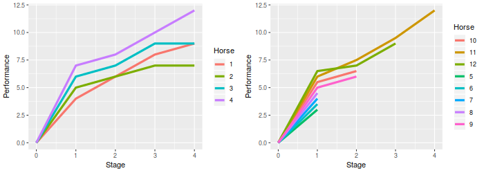

## Tuning with Hyperband {#hyperband}


Besides the more traditional tuning methods, the ecosystem around [mlr3](https://mlr3.mlr-org.com) offers another procedure for hyperparameter optimization called Hyperband implemented in the [mlr3hyperband](https://mlr3hyperband.mlr-org.com) package.
Hyperband is a budget-oriented procedure, weeding out suboptimal performing configurations early on during a partially sequential training process, increasing tuning efficiency as a consequence.
For this, a combination of incremental resource allocation and early stopping is used: As optimization progresses, computational resources are increased for more promising configurations, while less promising ones are terminated early.
To give an introductory analogy, imagine two horse trainers are given eight untrained horses.
Both trainers want to win the upcoming race, but they are only given 32 units of food.
Given that each horse can be fed up to 8 units food ("maximum budget" per horse), there is not enough food for all the horses.
It is critical to identify the most promising horses early, and give them enough food to improve.
So, the trainers need to develop a strategy to split up the food in the best possible way.
The first trainer is very optimistic and wants to explore the full capabilities of a horse, because he does not want to pass a judgement on a horse's performance unless it has been fully trained.
So, he divides his budget by the maximum amount he can give to a horse (lets say eight, so $32 / 8 = 4$) and randomly picks four horses - his budget simply is not enough to fully train more.
Those four horses are then trained to their full capabilities, while the rest is set free.
This way, the trainer is confident about choosing the best out of the four trained horses, but he might have overlooked the horse with the highest potential since he only focused on half of them.
The other trainer is more creative and develops a different strategy.
He thinks, if a horse is not performing well at the beginning, it will also not improve after further training.
Based on this assumption, he decides to give one unit of food to each horse and observes how they develop.
After the initial food is consumed, he checks their performance and kicks the slowest half out of his training regime.
Then, he increases the available food for the remaining, further trains them until the food is consumed again, only to kick out the worst half once more.
He repeats this until the one remaining horse gets the rest of the food.
This means only one horse is fully trained, but on the flip side, he was able to start training with all eight horses.
On race day, all the horses are put on the starting line.
But which trainer will have the winning horse?
The one, who tried to train a maximum amount of horses to their fullest?
Or the other one, who made assumptions about the training progress of his horses?
How the training phases may possibly look like is visualized in figure \@ref(fig:03-optimization-hyperband-001).

<div class="figure" style="text-align: center">

<p class="caption">(\#fig:03-optimization-hyperband-001)Visulization of how the training processes may look like. The left plot corresponds to the non-selective trainer, while the right one to the selective trainer.</p>
</div>

Hyperband works very similar in some ways, but also different in others.
It is not embodied by one of the trainers in our analogy, but more by the person, who would pay them.
Hyperband consists of several brackets, each bracket corresponding to a trainer, and we do not care about horses but about hyperparameter configurations of a machine learning algorithm.
The budget is not in terms of food, but in terms of a hyperparameter of the learner that scales in some way with the computational effort.
An example is the number of epochs we train a neural network, or the number of iterations in boosting.
Furthermore, there are not only two brackets (or trainers), but several, each placed at a unique spot between fully explorative of later training stages and extremely selective, equal to higher exploration of early training stages.
The level of selection aggressiveness is handled by a user-defined parameter called $\eta$.
So, $1/\eta$ is the fraction of remaining configurations after a bracket removes his worst performing ones, but $\eta$ is also the factor by that the budget is increased for the next stage.
Because there is a different maximum budget per configuration that makes sense in different scenarios, the user also has to set this as the $R$ parameter.
No further parameters are required for Hyperband -- the full required budget across all brackets is indirectly given by $$(\lfloor \log_{\eta}{R} \rfloor + 1)^2 * R$$ [@Li2016].
To give an idea how a full bracket layout might look like for a specific $R$ and $\eta$, a quick overview is given in the following table.


<table class="kable_wrapper">
<caption>(\#tab:03-optimization-hyperband-002)Hyperband layout for $\eta = 2$ and $R = 8$, consisting of four brackets with $n$ as the amount of active configurations.</caption>
<tbody>
  <tr>
   <td> 

| stage| budget|  n|
|-----:|------:|--:|
|     1|      1|  8|
|     2|      2|  4|
|     3|      4|  2|
|     4|      8|  1|

 </td>
   <td> 

| stage| budget|  n|
|-----:|------:|--:|
|     1|      2|  6|
|     2|      4|  3|
|     3|      8|  1|

 </td>
   <td> 

| stage| budget|  n|
|-----:|------:|--:|
|     1|      4|  4|
|     2|      8|  2|

 </td>
   <td> 

| stage| budget|  n|
|-----:|------:|--:|
|     1|      8|  4|

 </td>
  </tr>
</tbody>
</table>

Of course, early termination based on a performance criterion may be disadvantageous if it is done too aggressively in certain scenarios.
A learner to jumping radically in its estimated performance during the training phase may get the best configurations canceled too early, simply because they do not improve quickly enough compared to others.
In other words, it is often unclear beforehand if having an high amount of configurations $n$, that gets aggressively discarded early, is better than having a high budget $B$ per configuration.
The arising tradeoff, that has to be made, is called the "$n$ versus $B/n$ problem".
To create a balance between selection based on early training performance versus exploration of training performances in later training stages, $\lfloor \log_{\eta}{R} \rfloor + 1$ brackets are constructed with an associated set of varyingly sized configurations.
Thus, some brackets contain more configurations, with a small initial budget.
In these, a lot are discarded after having been trained for only a short amount of time, corresponding to the selective trainer in our horse analogy.
Others are constructed with fewer configurations, where discarding only takes place after a significant amount of budget was consumed.
The last bracket usually never discards anything, but also starts with only very few configurations -- this is equivalent to the trainer explorative of later stages.
The former corresponds high $n$, while the latter high $B/n$.
Even though different brackets are initialized with a different amount of configurations and different initial budget sizes, each bracket is assigned (approximately) the same budget $(\lfloor \log_{\eta}{R} \rfloor + 1) * R$.

The configurations at the start of each bracket are initialized by random, often uniform sampling.
Note that currently all configurations are trained completely from the beginning, so no online updates of models from stage to stage is happening.

To identify the budget for evaluating Hyperband, the user has to specify explicitly which hyperparameter of the learner influences the budget by extending a single hyperparameter in the [`ParamSet`](https://paradox.mlr-org.com/reference/ParamSet.html) with an argument (`tags = "budget"`), like in the following snippet:


```r
library(paradox)

# Hyperparameter subset of XGBoost
params = list(
  ParamInt$new("nrounds", lower = 1, upper = 16, tags = "budget"),
  ParamFct$new("booster", levels = c("gbtree", "gblinear", "dart"))
)
```

Thanks to the broad ecosystem of the [mlr3verse](https://mlr3verse.mlr-org.com) a learner does not require a natural budget parameter.
A typical case of this would be decision trees.
By using subsampling as preprocessing with [mlr3pipelines](https://mlr3pipelines.mlr-org.com), we can work around a lacking budget parameter.


```r
library(mlr3tuning)
library(mlr3hyperband)
library(mlr3pipelines)
set.seed(123)

# extend "classif.rpart" with "subsampling" as preprocessing step
ll = po("subsample") %>>% lrn("classif.rpart")

# extend hyperparameters of "classif.rpart" with subsampling fraction as budget
params = list(
  ParamDbl$new("classif.rpart.cp", lower = 0.001, upper = 0.1),
  ParamInt$new("classif.rpart.minsplit", lower = 1, upper = 10),
  ParamDbl$new("subsample.frac", lower = 0.1, upper = 1, tags = "budget")
)
```

We can now plug the new learner with the extended hyperparameter set into a [`TuningInstanceSingleCrit`](https://mlr3tuning.mlr-org.com/reference/TuningInstanceSingleCrit.html) the same way as usual.
Naturally, Hyperband terminates once all of its brackets are evaluated, so a [`Terminator`](https://bbotk.mlr-org.com/reference/Terminator.html) in the tuning instance acts as an upper bound and should be only set to a low value if one is unsure of how long Hyperband will take to finish under the given settings.


```r
inst = TuningInstanceSingleCrit$new(
  tsk("iris"),
  ll,
  rsmp("holdout"),
  msr("classif.ce"),
  ParamSet$new(params),
  trm("none") # hyperband terminates itself
)
```

Now, we initialize a new instance of the [`mlr3hyperband::TunerHyperband`](https://www.rdocumentation.org/packages/mlr3hyperband/topics/TunerHyperband) class and start tuning with it.


```r
tuner = tnr("hyperband", eta = 3)
tuner$optimize(inst)
```

```
## INFO  [19:27:30.574] Starting to optimize 3 parameter(s) with '<TunerHyperband>' and '<TerminatorNone>' 
## INFO  [19:27:30.627] Amount of brackets to be evaluated = 3,  
## INFO  [19:27:30.639] Start evaluation of bracket 1 
## INFO  [19:27:30.645] Training 9 configs with budget of 0.111111 for each 
## INFO  [19:27:30.649] Evaluating 9 configuration(s) 
## INFO  [19:27:32.161] Result of batch 1: 
## INFO  [19:27:32.166]  classif.rpart.cp classif.rpart.minsplit subsample.frac bracket bracket_stage 
## INFO  [19:27:32.166]           0.02533                      3         0.1111       2             0 
## INFO  [19:27:32.166]           0.07348                      5         0.1111       2             0 
## INFO  [19:27:32.166]           0.08490                      3         0.1111       2             0 
## INFO  [19:27:32.166]           0.05026                      6         0.1111       2             0 
## INFO  [19:27:32.166]           0.03940                      4         0.1111       2             0 
## INFO  [19:27:32.166]           0.02540                      7         0.1111       2             0 
## INFO  [19:27:32.166]           0.01200                      4         0.1111       2             0 
## INFO  [19:27:32.166]           0.03961                      4         0.1111       2             0 
## INFO  [19:27:32.166]           0.05762                      6         0.1111       2             0 
## INFO  [19:27:32.166]  budget_scaled budget_real n_configs classif.ce 
## INFO  [19:27:32.166]          1.111      0.1111         9       0.06 
## INFO  [19:27:32.166]          1.111      0.1111         9       0.08 
## INFO  [19:27:32.166]          1.111      0.1111         9       0.02 
## INFO  [19:27:32.166]          1.111      0.1111         9       0.02 
## INFO  [19:27:32.166]          1.111      0.1111         9       0.08 
## INFO  [19:27:32.166]          1.111      0.1111         9       0.02 
## INFO  [19:27:32.166]          1.111      0.1111         9       0.10 
## INFO  [19:27:32.166]          1.111      0.1111         9       0.14 
## INFO  [19:27:32.166]          1.111      0.1111         9       0.04 
## INFO  [19:27:32.166]                                 uhash 
## INFO  [19:27:32.166]  a90c0549-900d-4fe6-aea7-ba0288289cd7 
## INFO  [19:27:32.166]  ec8d343b-1d7f-4de8-bb93-c6e9b44e756c 
## INFO  [19:27:32.166]  2c01cfcc-6725-41ec-85bd-36a918ed285e 
## INFO  [19:27:32.166]  3e4b1b9c-0eb5-4829-86d1-13b31a7e4d77 
## INFO  [19:27:32.166]  7c0ee160-58ca-41c7-b0b7-6e4346d755f0 
## INFO  [19:27:32.166]  f913f9ed-7243-443f-8764-371ea02195dc 
## INFO  [19:27:32.166]  1560afd1-d456-4486-8d96-8129a2fa7043 
## INFO  [19:27:32.166]  433408cc-9a2d-4ad9-97cf-252315ddcfb2 
## INFO  [19:27:32.166]  2be3f405-d3be-4e03-9e9f-5a9384afb4bf 
## INFO  [19:27:32.167] Training 3 configs with budget of 0.333333 for each 
## INFO  [19:27:32.171] Evaluating 3 configuration(s) 
## INFO  [19:27:32.698] Result of batch 2: 
## INFO  [19:27:32.701]  classif.rpart.cp classif.rpart.minsplit subsample.frac bracket bracket_stage 
## INFO  [19:27:32.701]           0.08490                      3         0.3333       2             1 
## INFO  [19:27:32.701]           0.05026                      6         0.3333       2             1 
## INFO  [19:27:32.701]           0.02540                      7         0.3333       2             1 
## INFO  [19:27:32.701]  budget_scaled budget_real n_configs classif.ce 
## INFO  [19:27:32.701]          3.333      0.3333         3       0.02 
## INFO  [19:27:32.701]          3.333      0.3333         3       0.04 
## INFO  [19:27:32.701]          3.333      0.3333         3       0.06 
## INFO  [19:27:32.701]                                 uhash 
## INFO  [19:27:32.701]  b9ca5e9a-7ec7-4010-8204-b1ec85141c55 
## INFO  [19:27:32.701]  219be26a-59fa-4bbf-82fc-9824cadabb06 
## INFO  [19:27:32.701]  1b38ab88-70e4-4612-ad9c-16f81a5ca28c 
## INFO  [19:27:32.703] Training 1 configs with budget of 1 for each 
## INFO  [19:27:32.706] Evaluating 1 configuration(s) 
## INFO  [19:27:32.915] Result of batch 3: 
## INFO  [19:27:32.918]  classif.rpart.cp classif.rpart.minsplit subsample.frac bracket bracket_stage 
## INFO  [19:27:32.918]            0.0849                      3              1       2             2 
## INFO  [19:27:32.918]  budget_scaled budget_real n_configs classif.ce 
## INFO  [19:27:32.918]             10           1         1       0.04 
## INFO  [19:27:32.918]                                 uhash 
## INFO  [19:27:32.918]  a98b319b-9ca5-4225-8871-35f02be4892e 
## INFO  [19:27:32.919] Start evaluation of bracket 2 
## INFO  [19:27:32.923] Training 5 configs with budget of 0.333333 for each 
## INFO  [19:27:32.926] Evaluating 5 configuration(s) 
## INFO  [19:27:33.720] Result of batch 4: 
## INFO  [19:27:33.723]  classif.rpart.cp classif.rpart.minsplit subsample.frac bracket bracket_stage 
## INFO  [19:27:33.723]           0.08650                      6         0.3333       1             0 
## INFO  [19:27:33.723]           0.07491                      9         0.3333       1             0 
## INFO  [19:27:33.723]           0.06716                      6         0.3333       1             0 
## INFO  [19:27:33.723]           0.06218                      9         0.3333       1             0 
## INFO  [19:27:33.723]           0.03785                      4         0.3333       1             0 
## INFO  [19:27:33.723]  budget_scaled budget_real n_configs classif.ce 
## INFO  [19:27:33.723]          3.333      0.3333         5       0.04 
## INFO  [19:27:33.723]          3.333      0.3333         5       0.04 
## INFO  [19:27:33.723]          3.333      0.3333         5       0.08 
## INFO  [19:27:33.723]          3.333      0.3333         5       0.04 
## INFO  [19:27:33.723]          3.333      0.3333         5       0.02 
## INFO  [19:27:33.723]                                 uhash 
## INFO  [19:27:33.723]  7304e212-dc29-42f0-94de-098040e63785 
## INFO  [19:27:33.723]  ed58495d-107e-4136-a84d-f540070bcb42 
## INFO  [19:27:33.723]  e43f942c-c161-4572-bffe-70822e88e2bb 
## INFO  [19:27:33.723]  58e24c09-a83d-456d-95b2-f368596c3dd9 
## INFO  [19:27:33.723]  985ae05f-1ce3-414b-821c-21328264e598 
## INFO  [19:27:33.725] Training 1 configs with budget of 1 for each 
## INFO  [19:27:33.728] Evaluating 1 configuration(s) 
## INFO  [19:27:33.944] Result of batch 5: 
## INFO  [19:27:33.947]  classif.rpart.cp classif.rpart.minsplit subsample.frac bracket bracket_stage 
## INFO  [19:27:33.947]           0.03785                      4              1       1             1 
## INFO  [19:27:33.947]  budget_scaled budget_real n_configs classif.ce 
## INFO  [19:27:33.947]             10           1         1       0.04 
## INFO  [19:27:33.947]                                 uhash 
## INFO  [19:27:33.947]  690a02e0-8dff-4c74-8f7c-d8a5a187d894 
## INFO  [19:27:33.949] Start evaluation of bracket 3 
## INFO  [19:27:33.959] Training 3 configs with budget of 1 for each 
## INFO  [19:27:33.962] Evaluating 3 configuration(s) 
## INFO  [19:27:34.473] Result of batch 6: 
## INFO  [19:27:34.476]  classif.rpart.cp classif.rpart.minsplit subsample.frac bracket bracket_stage 
## INFO  [19:27:34.476]           0.02724                     10              1       0             0 
## INFO  [19:27:34.476]           0.05689                      3              1       0             0 
## INFO  [19:27:34.476]           0.09141                      4              1       0             0 
## INFO  [19:27:34.476]  budget_scaled budget_real n_configs classif.ce 
## INFO  [19:27:34.476]             10           1         3       0.04 
## INFO  [19:27:34.476]             10           1         3       0.04 
## INFO  [19:27:34.476]             10           1         3       0.04 
## INFO  [19:27:34.476]                                 uhash 
## INFO  [19:27:34.476]  125d8de8-f147-47cd-a98d-18fb17b8d32a 
## INFO  [19:27:34.476]  6ac06ccf-d922-4de0-b358-57ea6790f8ca 
## INFO  [19:27:34.476]  92372da8-e2aa-41de-b5cd-06bb8472190a 
## INFO  [19:27:34.494] Finished optimizing after 22 evaluation(s) 
## INFO  [19:27:34.495] Result: 
## INFO  [19:27:34.498]  classif.rpart.cp classif.rpart.minsplit subsample.frac learner_param_vals 
## INFO  [19:27:34.498]            0.0849                      3         0.1111          <list[6]> 
## INFO  [19:27:34.498]   x_domain classif.ce 
## INFO  [19:27:34.498]  <list[3]>       0.02
```

```
##    classif.rpart.cp classif.rpart.minsplit subsample.frac learner_param_vals
## 1:           0.0849                      3         0.1111          <list[6]>
##     x_domain classif.ce
## 1: <list[3]>       0.02
```

To receive the results of each sampled configuration, we simply run the following snippet.


```r
inst$archive$data()[, c(
  "subsample.frac",
  "classif.rpart.cp",
  "classif.rpart.minsplit",
  "classif.ce"
), with = FALSE]
```

```
##     subsample.frac classif.rpart.cp classif.rpart.minsplit classif.ce
##  1:         0.1111          0.02533                      3       0.06
##  2:         0.1111          0.07348                      5       0.08
##  3:         0.1111          0.08490                      3       0.02
##  4:         0.1111          0.05026                      6       0.02
##  5:         0.1111          0.03940                      4       0.08
##  6:         0.1111          0.02540                      7       0.02
##  7:         0.1111          0.01200                      4       0.10
##  8:         0.1111          0.03961                      4       0.14
##  9:         0.1111          0.05762                      6       0.04
## 10:         0.3333          0.08490                      3       0.02
## 11:         0.3333          0.05026                      6       0.04
## 12:         0.3333          0.02540                      7       0.06
## 13:         1.0000          0.08490                      3       0.04
## 14:         0.3333          0.08650                      6       0.04
## 15:         0.3333          0.07491                      9       0.04
## 16:         0.3333          0.06716                      6       0.08
## 17:         0.3333          0.06218                      9       0.04
## 18:         0.3333          0.03785                      4       0.02
## 19:         1.0000          0.03785                      4       0.04
## 20:         1.0000          0.02724                     10       0.04
## 21:         1.0000          0.05689                      3       0.04
## 22:         1.0000          0.09141                      4       0.04
##     subsample.frac classif.rpart.cp classif.rpart.minsplit classif.ce
```

You can acces the best found configuration through the instance object.


```r
inst$result
```

```
##    classif.rpart.cp classif.rpart.minsplit subsample.frac learner_param_vals
## 1:           0.0849                      3         0.1111          <list[6]>
##     x_domain classif.ce
## 1: <list[3]>       0.02
```

```r
inst$result_learner_param_vals
```

```
## $subsample.frac
## [1] 0.1111
## 
## $subsample.stratify
## [1] FALSE
## 
## $subsample.replace
## [1] FALSE
## 
## $classif.rpart.xval
## [1] 0
## 
## $classif.rpart.cp
## [1] 0.0849
## 
## $classif.rpart.minsplit
## [1] 3
```

```r
inst$result_y
```

```
## classif.ce 
##       0.02
```

If you are familiar with the original paper, you may have wondered how we just used Hyperband with a parameter ranging from `0.1` to `1.0` [@Li2016].
The answer is, with the help the internal rescaling of the budget parameter.
[mlr3hyperband](https://mlr3hyperband.mlr-org.com) automatically divides the budget parameters boundaries with its lower bound, ending up with a budget range starting again at `1`, like it is the case originally.
If we want an overview of what bracket layout Hyperband created and how the rescaling in each bracket worked, we can print a compact table to see this information.


```r
unique(inst$archive$data()[, .(bracket, bracket_stage, budget_scaled, budget_real, n_configs)])
```

```
##    bracket bracket_stage budget_scaled budget_real n_configs
## 1:       2             0         1.111      0.1111         9
## 2:       2             1         3.333      0.3333         3
## 3:       2             2        10.000      1.0000         1
## 4:       1             0         3.333      0.3333         5
## 5:       1             1        10.000      1.0000         1
## 6:       0             0        10.000      1.0000         3
```

In the traditional way, Hyperband uses uniform sampling to receive a configuration sample at the start of each bracket.
But it is also possible to define a custom [`Sampler`](https://paradox.mlr-org.com/reference/Sampler.html) for each hyperparameter.


```r
library(mlr3learners)
set.seed(123)

params = list(
  ParamInt$new("nrounds", lower = 1, upper = 16, tag = "budget"),
  ParamDbl$new("eta",     lower = 0, upper = 1),
  ParamFct$new("booster", levels = c("gbtree", "gblinear", "dart"))
)

inst = TuningInstanceSingleCrit$new(
  tsk("iris"),
  lrn("classif.xgboost"),
  rsmp("holdout"),
  msr("classif.ce"),
  ParamSet$new(params),
  trm("none") # hyperband terminates itself
)

# beta distribution with alpha = 2 and beta = 5
# categorical distribution with custom probabilities
sampler = SamplerJointIndep$new(list(
  Sampler1DRfun$new(params[[2]], function(n) rbeta(n, 2, 5)),
  Sampler1DCateg$new(params[[3]], prob = c(0.2, 0.3, 0.5))
))
```

Then, the defined sampler has to be given as an argument during instance creation.
Afterwards, the usual tuning can proceed.


```r
tuner = tnr("hyperband", eta = 2, sampler = sampler)
tuner$optimize(inst)
```

```
## INFO  [19:27:34.861] Starting to optimize 3 parameter(s) with '<TunerHyperband>' and '<TerminatorNone>' 
## INFO  [19:27:34.864] Amount of brackets to be evaluated = 5,  
## INFO  [19:27:34.865] Start evaluation of bracket 1 
## INFO  [19:27:34.870] Training 16 configs with budget of 1 for each 
## INFO  [19:27:34.873] Evaluating 16 configuration(s) 
## INFO  [19:27:37.724] Result of batch 1: 
## INFO  [19:27:37.727]      eta  booster nrounds bracket bracket_stage budget_scaled budget_real 
## INFO  [19:27:37.727]  0.16633 gblinear       1       4             0             1           1 
## INFO  [19:27:37.727]  0.53672 gblinear       1       4             0             1           1 
## INFO  [19:27:37.727]  0.23163     dart       1       4             0             1           1 
## INFO  [19:27:37.727]  0.09921     dart       1       4             0             1           1 
## INFO  [19:27:37.727]  0.32375     dart       1       4             0             1           1 
## INFO  [19:27:37.727]  0.25848 gblinear       1       4             0             1           1 
## INFO  [19:27:37.727]  0.28688 gblinear       1       4             0             1           1 
## INFO  [19:27:37.727]  0.36995   gbtree       1       4             0             1           1 
## INFO  [19:27:37.727]  0.21663 gblinear       1       4             0             1           1 
## INFO  [19:27:37.727]  0.43376     dart       1       4             0             1           1 
## INFO  [19:27:37.727]  0.24324 gblinear       1       4             0             1           1 
## INFO  [19:27:37.727]  0.35749     dart       1       4             0             1           1 
## INFO  [19:27:37.727]  0.38180     dart       1       4             0             1           1 
## INFO  [19:27:37.727]  0.22436     dart       1       4             0             1           1 
## INFO  [19:27:37.727]  0.57168     dart       1       4             0             1           1 
## INFO  [19:27:37.727]  0.52773   gbtree       1       4             0             1           1 
## INFO  [19:27:37.727]  n_configs classif.ce                                uhash 
## INFO  [19:27:37.727]         16       0.74 f53ae87b-dfa2-4b55-9706-e1cbaaa367c6 
## INFO  [19:27:37.727]         16       0.54 870c4a52-a858-4a16-ac5f-75227fa0166d 
## INFO  [19:27:37.727]         16       0.04 997267eb-89b0-4d67-8012-5bc50fd8f091 
## INFO  [19:27:37.727]         16       0.04 10200d59-b79e-492a-adbe-1b58e1342c91 
## INFO  [19:27:37.727]         16       0.04 4f467594-fb53-4b4f-92a9-839abb8cd782 
## INFO  [19:27:37.727]         16       0.70 09dacae7-240c-4242-834c-4684922cf127 
## INFO  [19:27:37.727]         16       0.74 4f30e742-3974-42af-b64a-d5a1f9fe06ab 
## INFO  [19:27:37.727]         16       0.04 7eea908b-8a8e-4966-ab10-9a088d7389e6 
## INFO  [19:27:37.727]         16       0.74 86fdaa51-ec96-482a-a5a0-1d2c9d7d80ca 
## INFO  [19:27:37.727]         16       0.04 1815f231-a570-4442-881a-3668edbe6275 
## INFO  [19:27:37.727]         16       0.74 40eb2cbf-f87b-45d1-9eaf-0bd98e973b49 
## INFO  [19:27:37.727]         16       0.04 258b96cc-a40a-43ec-b64b-be55054c7e26 
## INFO  [19:27:37.727]         16       0.04 cfedb767-c687-484f-a4c4-4f210ef908a8 
## INFO  [19:27:37.727]         16       0.04 e8db622d-545f-4ba8-9707-2abfc04542f5 
## INFO  [19:27:37.727]         16       0.04 572d23c2-0459-41e4-affb-a0079b4d5f2c 
## INFO  [19:27:37.727]         16       0.04 55898079-5834-40e3-b79a-f786639ba321 
## INFO  [19:27:37.728] Training 8 configs with budget of 2 for each 
## INFO  [19:27:37.732] Evaluating 8 configuration(s) 
## INFO  [19:27:38.642] Result of batch 2: 
## INFO  [19:27:38.645]      eta booster nrounds bracket bracket_stage budget_scaled budget_real 
## INFO  [19:27:38.645]  0.23163    dart       2       4             1             2           2 
## INFO  [19:27:38.645]  0.09921    dart       2       4             1             2           2 
## INFO  [19:27:38.645]  0.32375    dart       2       4             1             2           2 
## INFO  [19:27:38.645]  0.36995  gbtree       2       4             1             2           2 
## INFO  [19:27:38.645]  0.43376    dart       2       4             1             2           2 
## INFO  [19:27:38.645]  0.35749    dart       2       4             1             2           2 
## INFO  [19:27:38.645]  0.38180    dart       2       4             1             2           2 
## INFO  [19:27:38.645]  0.22436    dart       2       4             1             2           2 
## INFO  [19:27:38.645]  n_configs classif.ce                                uhash 
## INFO  [19:27:38.645]          8       0.04 399bcafe-c926-4fad-9b5f-7f7361a54d7e 
## INFO  [19:27:38.645]          8       0.04 1174ffdd-6179-491b-bf55-c58ee04ff187 
## INFO  [19:27:38.645]          8       0.04 ca7f974c-12ca-45f6-a1bc-7b7e11cf46cf 
## INFO  [19:27:38.645]          8       0.04 351be35e-07a0-41f0-90e0-803dd7dbf7c6 
## INFO  [19:27:38.645]          8       0.04 a20919d6-9808-41df-add6-5e861389c9a5 
## INFO  [19:27:38.645]          8       0.04 9e55e33c-8100-4940-a44b-ec9a05c238b5 
## INFO  [19:27:38.645]          8       0.04 e3138e54-39a6-471f-8248-c1f0feec9d53 
## INFO  [19:27:38.645]          8       0.04 ddeabeef-7e9d-4e7f-8d67-1d2e3cc419c6 
## INFO  [19:27:38.647] Training 4 configs with budget of 4 for each 
## INFO  [19:27:38.650] Evaluating 4 configuration(s) 
## INFO  [19:27:39.158] Result of batch 3: 
## INFO  [19:27:39.161]      eta booster nrounds bracket bracket_stage budget_scaled budget_real 
## INFO  [19:27:39.161]  0.23163    dart       4       4             2             4           4 
## INFO  [19:27:39.161]  0.09921    dart       4       4             2             4           4 
## INFO  [19:27:39.161]  0.32375    dart       4       4             2             4           4 
## INFO  [19:27:39.161]  0.36995  gbtree       4       4             2             4           4 
## INFO  [19:27:39.161]  n_configs classif.ce                                uhash 
## INFO  [19:27:39.161]          4       0.04 e10df46e-dd2c-42e0-acf4-76dd2235a617 
## INFO  [19:27:39.161]          4       0.04 425a95f2-8fe4-44c0-b5b0-9a2650a44081 
## INFO  [19:27:39.161]          4       0.04 39d152b8-faeb-47e0-a203-97b52c211399 
## INFO  [19:27:39.161]          4       0.04 834d6b24-4ead-4f3d-b506-ede3f420d3a9 
## INFO  [19:27:39.162] Training 2 configs with budget of 8 for each 
## INFO  [19:27:39.166] Evaluating 2 configuration(s) 
## INFO  [19:27:39.458] Result of batch 4: 
## INFO  [19:27:39.461]      eta booster nrounds bracket bracket_stage budget_scaled budget_real 
## INFO  [19:27:39.461]  0.23163    dart       8       4             3             8           8 
## INFO  [19:27:39.461]  0.09921    dart       8       4             3             8           8 
## INFO  [19:27:39.461]  n_configs classif.ce                                uhash 
## INFO  [19:27:39.461]          2       0.04 de471226-eca5-4c8b-bbda-8494fcd84434 
## INFO  [19:27:39.461]          2       0.04 79e76901-2231-482c-add9-5803a2974edf 
## INFO  [19:27:39.463] Training 1 configs with budget of 16 for each 
## INFO  [19:27:39.466] Evaluating 1 configuration(s) 
## INFO  [19:27:39.657] Result of batch 5: 
## INFO  [19:27:39.660]     eta booster nrounds bracket bracket_stage budget_scaled budget_real 
## INFO  [19:27:39.660]  0.2316    dart      16       4             4            16          16 
## INFO  [19:27:39.660]  n_configs classif.ce                                uhash 
## INFO  [19:27:39.660]          1       0.04 62368c66-97f5-4bc7-b351-d49a1929acce 
## INFO  [19:27:39.662] Start evaluation of bracket 2 
## INFO  [19:27:39.666] Training 10 configs with budget of 2 for each 
## INFO  [19:27:39.669] Evaluating 10 configuration(s) 
## INFO  [19:27:40.806] Result of batch 6: 
## INFO  [19:27:40.809]      eta  booster nrounds bracket bracket_stage budget_scaled budget_real 
## INFO  [19:27:40.809]  0.17165 gblinear       2       3             0             2           2 
## INFO  [19:27:40.809]  0.33565   gbtree       2       3             0             2           2 
## INFO  [19:27:40.809]  0.30172   gbtree       2       3             0             2           2 
## INFO  [19:27:40.809]  0.12918     dart       2       3             0             2           2 
## INFO  [19:27:40.809]  0.27153     dart       2       3             0             2           2 
## INFO  [19:27:40.809]  0.38573 gblinear       2       3             0             2           2 
## INFO  [19:27:40.809]  0.29412 gblinear       2       3             0             2           2 
## INFO  [19:27:40.809]  0.20787     dart       2       3             0             2           2 
## INFO  [19:27:40.809]  0.03459 gblinear       2       3             0             2           2 
## INFO  [19:27:40.809]  0.56669 gblinear       2       3             0             2           2 
## INFO  [19:27:40.809]  n_configs classif.ce                                uhash 
## INFO  [19:27:40.809]         10       0.74 5636e751-ec4b-4999-b62e-b6a764ba6e60 
## INFO  [19:27:40.809]         10       0.04 1c9563c9-e565-4455-8ecc-c90b530fd63f 
## INFO  [19:27:40.809]         10       0.04 4efe52d3-fee4-4298-b672-bbea2c639ae8 
## INFO  [19:27:40.809]         10       0.04 31ee4321-88f9-4dec-8a34-2855f9c98426 
## INFO  [19:27:40.809]         10       0.04 acb27efd-b0fe-431f-81c2-5ae41d9f86e5 
## INFO  [19:27:40.809]         10       0.42 fa6224c6-6a13-4134-82cc-bf014fe7edeb 
## INFO  [19:27:40.809]         10       0.46 4bbfabe2-7091-4b94-9f4f-f09c182cdb27 
## INFO  [19:27:40.809]         10       0.04 b05cde4f-572b-49da-9448-16a281710c93 
## INFO  [19:27:40.809]         10       0.74 0e4ed079-485f-4cfa-827d-c045e6ed89bb 
## INFO  [19:27:40.809]         10       0.42 41b40ba0-0885-4be7-9f16-393b02e3e5c2 
## INFO  [19:27:40.811] Training 5 configs with budget of 4 for each 
## INFO  [19:27:40.815] Evaluating 5 configuration(s) 
## INFO  [19:27:41.420] Result of batch 7: 
## INFO  [19:27:41.423]     eta booster nrounds bracket bracket_stage budget_scaled budget_real 
## INFO  [19:27:41.423]  0.3356  gbtree       4       3             1             4           4 
## INFO  [19:27:41.423]  0.3017  gbtree       4       3             1             4           4 
## INFO  [19:27:41.423]  0.1292    dart       4       3             1             4           4 
## INFO  [19:27:41.423]  0.2715    dart       4       3             1             4           4 
## INFO  [19:27:41.423]  0.2079    dart       4       3             1             4           4 
## INFO  [19:27:41.423]  n_configs classif.ce                                uhash 
## INFO  [19:27:41.423]          5       0.04 2535fb83-3f3d-462b-b5fd-993eb902138e 
## INFO  [19:27:41.423]          5       0.04 42d347a6-618c-4155-8a2d-a44447dd5d25 
## INFO  [19:27:41.423]          5       0.04 1e2389b2-aea4-4698-88bb-266abd0bbdb2 
## INFO  [19:27:41.423]          5       0.04 7e3ebe66-f76e-4b97-a083-79a2e74473f0 
## INFO  [19:27:41.423]          5       0.04 bd72ee96-7c1e-4582-a77b-61009d50d94e 
## INFO  [19:27:41.425] Training 2 configs with budget of 8 for each 
## INFO  [19:27:41.428] Evaluating 2 configuration(s) 
## INFO  [19:27:41.722] Result of batch 8: 
## INFO  [19:27:41.725]     eta booster nrounds bracket bracket_stage budget_scaled budget_real 
## INFO  [19:27:41.725]  0.3356  gbtree       8       3             2             8           8 
## INFO  [19:27:41.725]  0.3017  gbtree       8       3             2             8           8 
## INFO  [19:27:41.725]  n_configs classif.ce                                uhash 
## INFO  [19:27:41.725]          2       0.04 ee297b2b-3e50-4c84-93eb-322add1df1f5 
## INFO  [19:27:41.725]          2       0.04 8b51dbee-93e2-4452-88ae-b7c8f20ac311 
## INFO  [19:27:41.726] Training 1 configs with budget of 16 for each 
## INFO  [19:27:41.730] Evaluating 1 configuration(s) 
## INFO  [19:27:41.923] Result of batch 9: 
## INFO  [19:27:41.926]     eta booster nrounds bracket bracket_stage budget_scaled budget_real 
## INFO  [19:27:41.926]  0.3356  gbtree      16       3             3            16          16 
## INFO  [19:27:41.926]  n_configs classif.ce                                uhash 
## INFO  [19:27:41.926]          1       0.04 f279c87f-e858-4657-8ea8-afd6f3ccd153 
## INFO  [19:27:41.928] Start evaluation of bracket 3 
## INFO  [19:27:41.932] Training 7 configs with budget of 4 for each 
## INFO  [19:27:41.935] Evaluating 7 configuration(s) 
## INFO  [19:27:42.757] Result of batch 10: 
## INFO  [19:27:42.760]      eta  booster nrounds bracket bracket_stage budget_scaled budget_real 
## INFO  [19:27:42.760]  0.41312 gblinear       4       2             0             4           4 
## INFO  [19:27:42.760]  0.21633     dart       4       2             0             4           4 
## INFO  [19:27:42.760]  0.52311     dart       4       2             0             4           4 
## INFO  [19:27:42.760]  0.21596     dart       4       2             0             4           4 
## INFO  [19:27:42.760]  0.54437   gbtree       4       2             0             4           4 
## INFO  [19:27:42.760]  0.11852     dart       4       2             0             4           4 
## INFO  [19:27:42.760]  0.09508     dart       4       2             0             4           4 
## INFO  [19:27:42.760]  n_configs classif.ce                                uhash 
## INFO  [19:27:42.760]          7       0.42 f78b5e0d-6b9d-4ced-820b-3e0f706a2d14 
## INFO  [19:27:42.760]          7       0.04 0f30ba4d-289b-4db4-8c71-b91bc0de4b63 
## INFO  [19:27:42.760]          7       0.04 d938e732-3b84-4aff-a748-4e540970f39c 
## INFO  [19:27:42.760]          7       0.04 e9a5ca70-1665-4a16-844d-3fdcb307c9fb 
## INFO  [19:27:42.760]          7       0.04 fb55073d-b4db-4018-a422-5df5a82de17e 
## INFO  [19:27:42.760]          7       0.04 69f938f6-700e-4295-ad69-b7d351b4b4b8 
## INFO  [19:27:42.760]          7       0.04 ac477a27-2f91-498f-8c65-2cec4ed096a3 
## INFO  [19:27:42.762] Training 3 configs with budget of 8 for each 
## INFO  [19:27:42.766] Evaluating 3 configuration(s) 
## INFO  [19:27:43.171] Result of batch 11: 
## INFO  [19:27:43.174]     eta booster nrounds bracket bracket_stage budget_scaled budget_real 
## INFO  [19:27:43.174]  0.2163    dart       8       2             1             8           8 
## INFO  [19:27:43.174]  0.5231    dart       8       2             1             8           8 
## INFO  [19:27:43.174]  0.2160    dart       8       2             1             8           8 
## INFO  [19:27:43.174]  n_configs classif.ce                                uhash 
## INFO  [19:27:43.174]          3       0.04 7fcc6e50-1366-4036-84d0-6b5e6a80a0a2 
## INFO  [19:27:43.174]          3       0.04 2c4ceef4-5fe8-4a23-b9a8-76577158a423 
## INFO  [19:27:43.174]          3       0.04 f48ebd18-9955-4b9c-b707-f3147b926bab 
## INFO  [19:27:43.176] Training 1 configs with budget of 16 for each 
## INFO  [19:27:43.179] Evaluating 1 configuration(s) 
## INFO  [19:27:43.632] Result of batch 12: 
## INFO  [19:27:43.635]     eta booster nrounds bracket bracket_stage budget_scaled budget_real 
## INFO  [19:27:43.635]  0.2163    dart      16       2             2            16          16 
## INFO  [19:27:43.635]  n_configs classif.ce                                uhash 
## INFO  [19:27:43.635]          1       0.04 a7d74986-9f8b-4ce1-aa0d-47e549e23460 
## INFO  [19:27:43.636] Start evaluation of bracket 4 
## INFO  [19:27:43.641] Training 5 configs with budget of 8 for each 
## INFO  [19:27:43.643] Evaluating 5 configuration(s) 
## INFO  [19:27:44.216] Result of batch 13: 
## INFO  [19:27:44.219]     eta  booster nrounds bracket bracket_stage budget_scaled budget_real 
## INFO  [19:27:44.219]  0.2462   gbtree       8       1             0             8           8 
## INFO  [19:27:44.219]  0.5226 gblinear       8       1             0             8           8 
## INFO  [19:27:44.219]  0.1413 gblinear       8       1             0             8           8 
## INFO  [19:27:44.219]  0.1950     dart       8       1             0             8           8 
## INFO  [19:27:44.219]  0.4708 gblinear       8       1             0             8           8 
## INFO  [19:27:44.219]  n_configs classif.ce                                uhash 
## INFO  [19:27:44.219]          5       0.04 b3894018-392b-4406-a054-ec5a7f2f7bed 
## INFO  [19:27:44.219]          5       0.42 4ef20222-ccda-404c-a844-8e9113065028 
## INFO  [19:27:44.219]          5       0.42 07ead0bd-a9a1-40c0-8454-4e2755db538e 
## INFO  [19:27:44.219]          5       0.04 eef0f014-de91-4aa1-a561-73e2b320aecd 
## INFO  [19:27:44.219]          5       0.42 10310d4c-ef3b-4db4-8efe-f7368dc3cdb3 
## INFO  [19:27:44.221] Training 2 configs with budget of 16 for each 
## INFO  [19:27:44.230] Evaluating 2 configuration(s) 
## INFO  [19:27:44.507] Result of batch 14: 
## INFO  [19:27:44.510]     eta booster nrounds bracket bracket_stage budget_scaled budget_real 
## INFO  [19:27:44.510]  0.2462  gbtree      16       1             1            16          16 
## INFO  [19:27:44.510]  0.1950    dart      16       1             1            16          16 
## INFO  [19:27:44.510]  n_configs classif.ce                                uhash 
## INFO  [19:27:44.510]          2       0.04 04dd2277-27b8-4975-ae9d-a6b81ada0f37 
## INFO  [19:27:44.510]          2       0.04 f186f058-9483-4e08-8c1c-c18d1b9ccbac 
## INFO  [19:27:44.511] Start evaluation of bracket 5 
## INFO  [19:27:44.516] Training 5 configs with budget of 16 for each 
## INFO  [19:27:44.519] Evaluating 5 configuration(s) 
## INFO  [19:27:45.128] Result of batch 15: 
## INFO  [19:27:45.131]      eta booster nrounds bracket bracket_stage budget_scaled budget_real 
## INFO  [19:27:45.131]  0.08993    dart      16       0             0            16          16 
## INFO  [19:27:45.131]  0.42262    dart      16       0             0            16          16 
## INFO  [19:27:45.131]  0.09600  gbtree      16       0             0            16          16 
## INFO  [19:27:45.131]  0.17779    dart      16       0             0            16          16 
## INFO  [19:27:45.131]  0.61866    dart      16       0             0            16          16 
## INFO  [19:27:45.131]  n_configs classif.ce                                uhash 
## INFO  [19:27:45.131]          5       0.04 4ec75167-80ba-4938-807a-5e0467ffcc75 
## INFO  [19:27:45.131]          5       0.04 6293d26b-0313-4576-a1cd-8a8ca110f100 
## INFO  [19:27:45.131]          5       0.04 0998f8e6-1a88-49b4-8483-928084961535 
## INFO  [19:27:45.131]          5       0.04 ea176150-aebf-4113-93d1-224f57beed04 
## INFO  [19:27:45.131]          5       0.04 d63dea94-4bbd-4223-8c0f-06a6530c5556 
## INFO  [19:27:45.137] Finished optimizing after 72 evaluation(s) 
## INFO  [19:27:45.139] Result: 
## INFO  [19:27:45.141]  nrounds    eta booster learner_param_vals  x_domain classif.ce 
## INFO  [19:27:45.141]        1 0.2316    dart          <list[4]> <list[3]>       0.04
```

```
##    nrounds    eta booster learner_param_vals  x_domain classif.ce
## 1:       1 0.2316    dart          <list[4]> <list[3]>       0.04
```

```r
inst$result
```

```
##    nrounds    eta booster learner_param_vals  x_domain classif.ce
## 1:       1 0.2316    dart          <list[4]> <list[3]>       0.04
```

Furthermore, we extended the original algorithm, to make it also possible to use [mlr3hyperband](https://mlr3hyperband.mlr-org.com) for multi-objective optimization.
To do this, simply specify more measures in the [`TuningInstanceMultiCrit`](https://mlr3tuning.mlr-org.com/reference/TuningInstanceMultiCrit.html) and run the rest as usual.


```r
inst = TuningInstanceMultiCrit$new(
  tsk("pima"),
  lrn("classif.xgboost"),
  rsmp("holdout"),
  msrs(c("classif.tpr", "classif.fpr")),
  ParamSet$new(params),
  trm("none") # hyperband terminates itself
)

tuner = tnr("hyperband", eta = 4)
tuner$optimize(inst)
```

```
## INFO  [19:27:45.524] Starting to optimize 3 parameter(s) with '<TunerHyperband>' and '<TerminatorNone>' 
## INFO  [19:27:45.536] Amount of brackets to be evaluated = 3,  
## INFO  [19:27:45.537] Start evaluation of bracket 1 
## INFO  [19:27:45.541] Training 16 configs with budget of 1 for each 
## INFO  [19:27:45.545] Evaluating 16 configuration(s) 
## INFO  [19:27:47.349] Result of batch 1: 
## INFO  [19:27:47.352]      eta  booster nrounds bracket bracket_stage budget_scaled budget_real 
## INFO  [19:27:47.352]  0.20737 gblinear       1       2             0             1           1 
## INFO  [19:27:47.352]  0.45924   gbtree       1       2             0             1           1 
## INFO  [19:27:47.352]  0.24150 gblinear       1       2             0             1           1 
## INFO  [19:27:47.352]  0.11869   gbtree       1       2             0             1           1 
## INFO  [19:27:47.352]  0.07247   gbtree       1       2             0             1           1 
## INFO  [19:27:47.352]  0.69099     dart       1       2             0             1           1 
## INFO  [19:27:47.352]  0.28696     dart       1       2             0             1           1 
## INFO  [19:27:47.352]  0.14941     dart       1       2             0             1           1 
## INFO  [19:27:47.352]  0.97243   gbtree       1       2             0             1           1 
## INFO  [19:27:47.352]  0.41051 gblinear       1       2             0             1           1 
## INFO  [19:27:47.352]  0.40181     dart       1       2             0             1           1 
## INFO  [19:27:47.352]  0.64856     dart       1       2             0             1           1 
## INFO  [19:27:47.352]  0.91631 gblinear       1       2             0             1           1 
## INFO  [19:27:47.352]  0.21666   gbtree       1       2             0             1           1 
## INFO  [19:27:47.352]  0.54800 gblinear       1       2             0             1           1 
## INFO  [19:27:47.352]  0.72005 gblinear       1       2             0             1           1 
## INFO  [19:27:47.352]  n_configs classif.tpr classif.fpr                                uhash 
## INFO  [19:27:47.352]         16      0.0000      0.0000 5f0198c8-f283-4b2f-8474-51d5aa0790c1 
## INFO  [19:27:47.352]         16      0.7531      0.2571 c40ae2d7-beab-4d3f-a6cf-5d523f611cc0 
## INFO  [19:27:47.352]         16      0.0000      0.0000 07f31a5b-de6a-4b74-b6b4-daaa0d48bd39 
## INFO  [19:27:47.352]         16      0.7407      0.2457 5f891f2f-87cc-4e44-874b-d0a8d7f50072 
## INFO  [19:27:47.352]         16      0.7407      0.2571 6d253afe-d7b1-4577-9229-3b194026be50 
## INFO  [19:27:47.352]         16      0.7407      0.2629 e79207e2-23fb-43c6-a22c-699b90bc9147 
## INFO  [19:27:47.352]         16      0.7531      0.2629 3f4cfc11-37db-449d-a9b2-05d729b8cc2a 
## INFO  [19:27:47.352]         16      0.7407      0.2514 ce4b4d05-465a-489d-a8d7-06718313348e 
## INFO  [19:27:47.352]         16      0.7531      0.2571 9c436b41-d1ac-419b-8781-a8c019395d78 
## INFO  [19:27:47.352]         16      0.0000      0.0000 4d089b56-5310-4340-b91d-134b0fae2d49 
## INFO  [19:27:47.352]         16      0.7407      0.2457 5ac9e3c6-2b08-4ab9-a4a0-e692d6dd0bbe 
## INFO  [19:27:47.352]         16      0.7531      0.2686 73d61aa0-002e-414f-a786-5ffcadff914e 
## INFO  [19:27:47.352]         16      0.0000      0.0000 75435253-2577-47dc-b145-65e1ed779243 
## INFO  [19:27:47.352]         16      0.7407      0.2571 db462b78-581a-49ee-86e8-bc4787fd3e4f 
## INFO  [19:27:47.352]         16      0.0000      0.0000 ac17a9e2-7dd0-476a-845c-24824c5fa6c0 
## INFO  [19:27:47.352]         16      0.0000      0.0000 82c848ec-2d16-4ed8-b282-0db380dee667 
## INFO  [19:27:47.354] Training 4 configs with budget of 4 for each 
## INFO  [19:27:47.359] Evaluating 4 configuration(s) 
## INFO  [19:27:47.884] Result of batch 2: 
## INFO  [19:27:47.887]     eta  booster nrounds bracket bracket_stage budget_scaled budget_real 
## INFO  [19:27:47.887]  0.4592   gbtree       4       2             1             4           4 
## INFO  [19:27:47.887]  0.1187   gbtree       4       2             1             4           4 
## INFO  [19:27:47.887]  0.5480 gblinear       4       2             1             4           4 
## INFO  [19:27:47.887]  0.7201 gblinear       4       2             1             4           4 
## INFO  [19:27:47.887]  n_configs classif.tpr classif.fpr                                uhash 
## INFO  [19:27:47.887]          4     0.66667     0.18286 c327daf2-b9ef-4517-864e-8b6b06f31382 
## INFO  [19:27:47.887]          4     0.72840     0.22286 57c2caad-b73b-45b4-8082-d13f3528c397 
## INFO  [19:27:47.887]          4     0.06173     0.04000 317d84e8-903d-4c4a-9796-468d6cc3c71f 
## INFO  [19:27:47.887]          4     0.09877     0.05143 02440e76-7f86-4029-9869-3cba50f7041a 
## INFO  [19:27:47.888] Training 1 configs with budget of 16 for each 
## INFO  [19:27:47.892] Evaluating 1 configuration(s) 
## INFO  [19:27:48.083] Result of batch 3: 
## INFO  [19:27:48.086]     eta booster nrounds bracket bracket_stage budget_scaled budget_real 
## INFO  [19:27:48.086]  0.1187  gbtree      16       2             2            16          16 
## INFO  [19:27:48.086]  n_configs classif.tpr classif.fpr                                uhash 
## INFO  [19:27:48.086]          1      0.5926      0.1543 9d7c68c4-e55a-4fe2-8e07-9545c62dce39 
## INFO  [19:27:48.087] Start evaluation of bracket 2 
## INFO  [19:27:48.092] Training 6 configs with budget of 4 for each 
## INFO  [19:27:48.095] Evaluating 6 configuration(s) 
## INFO  [19:27:48.847] Result of batch 4: 
## INFO  [19:27:48.850]      eta  booster nrounds bracket bracket_stage budget_scaled budget_real 
## INFO  [19:27:48.850]  0.98871     dart       4       1             0             4           4 
## INFO  [19:27:48.850]  0.06475   gbtree       4       1             0             4           4 
## INFO  [19:27:48.850]  0.15766 gblinear       4       1             0             4           4 
## INFO  [19:27:48.850]  0.78535   gbtree       4       1             0             4           4 
## INFO  [19:27:48.850]  0.54219     dart       4       1             0             4           4 
## INFO  [19:27:48.850]  0.41655 gblinear       4       1             0             4           4 
## INFO  [19:27:48.850]  n_configs classif.tpr classif.fpr                                uhash 
## INFO  [19:27:48.850]          6     0.61728     0.17714 6a93f931-1fd9-4f60-82a2-fe093ffdea36 
## INFO  [19:27:48.850]          6     0.64198     0.18286 1bf3b4e2-fa71-4408-a47f-511d1de1873f 
## INFO  [19:27:48.850]          6     0.00000     0.00000 b0a132f4-d5f4-43d4-921d-1d080e99bf91 
## INFO  [19:27:48.850]          6     0.66667     0.18857 1f648595-1c0b-47df-a6d4-4419daba4a75 
## INFO  [19:27:48.850]          6     0.60494     0.15429 6761006d-7941-4ccf-af2e-6b705a2ca12b 
## INFO  [19:27:48.850]          6     0.03704     0.01143 61d5ec8e-42d7-4260-a313-710a8329bbe9 
## INFO  [19:27:48.852] Training 1 configs with budget of 16 for each 
## INFO  [19:27:48.856] Evaluating 1 configuration(s) 
## INFO  [19:27:49.055] Result of batch 5: 
## INFO  [19:27:49.057]     eta booster nrounds bracket bracket_stage budget_scaled budget_real 
## INFO  [19:27:49.057]  0.7853  gbtree      16       1             1            16          16 
## INFO  [19:27:49.057]  n_configs classif.tpr classif.fpr                                uhash 
## INFO  [19:27:49.057]          1      0.6543      0.2114 ed0b03e4-2e99-43c9-90b0-1dab741d6d01 
## INFO  [19:27:49.059] Start evaluation of bracket 3 
## INFO  [19:27:49.063] Training 3 configs with budget of 16 for each 
## INFO  [19:27:49.066] Evaluating 3 configuration(s) 
## INFO  [19:27:49.516] Result of batch 6: 
## INFO  [19:27:49.519]     eta  booster nrounds bracket bracket_stage budget_scaled budget_real 
## INFO  [19:27:49.519]  0.5221     dart      16       0             0            16          16 
## INFO  [19:27:49.519]  0.1117   gbtree      16       0             0            16          16 
## INFO  [19:27:49.519]  0.8860 gblinear      16       0             0            16          16 
## INFO  [19:27:49.519]  n_configs classif.tpr classif.fpr                                uhash 
## INFO  [19:27:49.519]          3      0.6420      0.2171 d298bbdc-e294-4f97-b7ee-e0865165c20f 
## INFO  [19:27:49.519]          3      0.6543      0.1714 0ad8174b-4474-4cc7-9c07-28948e948d3c 
## INFO  [19:27:49.519]          3      0.4321      0.1543 80fa2080-4ad2-4aef-ae36-c7e9d9f188eb 
## INFO  [19:27:49.527] Finished optimizing after 31 evaluation(s) 
## INFO  [19:27:49.528] Result: 
## INFO  [19:27:49.531]  nrounds    eta  booster learner_param_vals  x_domain classif.tpr classif.fpr 
## INFO  [19:27:49.531]        1 0.2074 gblinear          <list[4]> <list[3]>     0.00000     0.00000 
## INFO  [19:27:49.531]        1 0.4592   gbtree          <list[4]> <list[3]>     0.75309     0.25714 
## INFO  [19:27:49.531]        1 0.2415 gblinear          <list[4]> <list[3]>     0.00000     0.00000 
## INFO  [19:27:49.531]        1 0.1187   gbtree          <list[4]> <list[3]>     0.74074     0.24571 
## INFO  [19:27:49.531]        1 0.9724   gbtree          <list[4]> <list[3]>     0.75309     0.25714 
## INFO  [19:27:49.531]        1 0.4105 gblinear          <list[4]> <list[3]>     0.00000     0.00000 
## INFO  [19:27:49.531]        1 0.4018     dart          <list[4]> <list[3]>     0.74074     0.24571 
## INFO  [19:27:49.531]        1 0.9163 gblinear          <list[4]> <list[3]>     0.00000     0.00000 
## INFO  [19:27:49.531]        1 0.5480 gblinear          <list[4]> <list[3]>     0.00000     0.00000 
## INFO  [19:27:49.531]        1 0.7201 gblinear          <list[4]> <list[3]>     0.00000     0.00000 
## INFO  [19:27:49.531]        4 0.4592   gbtree          <list[4]> <list[3]>     0.66667     0.18286 
## INFO  [19:27:49.531]        4 0.1187   gbtree          <list[4]> <list[3]>     0.72840     0.22286 
## INFO  [19:27:49.531]        4 0.5480 gblinear          <list[4]> <list[3]>     0.06173     0.04000 
## INFO  [19:27:49.531]        4 0.7201 gblinear          <list[4]> <list[3]>     0.09877     0.05143 
## INFO  [19:27:49.531]        4 0.1577 gblinear          <list[4]> <list[3]>     0.00000     0.00000 
## INFO  [19:27:49.531]        4 0.5422     dart          <list[4]> <list[3]>     0.60494     0.15429 
## INFO  [19:27:49.531]        4 0.4165 gblinear          <list[4]> <list[3]>     0.03704     0.01143 
## INFO  [19:27:49.531]       16 0.1117   gbtree          <list[4]> <list[3]>     0.65432     0.17143
```

```
##     nrounds    eta  booster learner_param_vals  x_domain classif.tpr
##  1:       1 0.2074 gblinear          <list[4]> <list[3]>     0.00000
##  2:       1 0.4592   gbtree          <list[4]> <list[3]>     0.75309
##  3:       1 0.2415 gblinear          <list[4]> <list[3]>     0.00000
##  4:       1 0.1187   gbtree          <list[4]> <list[3]>     0.74074
##  5:       1 0.9724   gbtree          <list[4]> <list[3]>     0.75309
##  6:       1 0.4105 gblinear          <list[4]> <list[3]>     0.00000
##  7:       1 0.4018     dart          <list[4]> <list[3]>     0.74074
##  8:       1 0.9163 gblinear          <list[4]> <list[3]>     0.00000
##  9:       1 0.5480 gblinear          <list[4]> <list[3]>     0.00000
## 10:       1 0.7201 gblinear          <list[4]> <list[3]>     0.00000
## 11:       4 0.4592   gbtree          <list[4]> <list[3]>     0.66667
## 12:       4 0.1187   gbtree          <list[4]> <list[3]>     0.72840
## 13:       4 0.5480 gblinear          <list[4]> <list[3]>     0.06173
## 14:       4 0.7201 gblinear          <list[4]> <list[3]>     0.09877
## 15:       4 0.1577 gblinear          <list[4]> <list[3]>     0.00000
## 16:       4 0.5422     dart          <list[4]> <list[3]>     0.60494
## 17:       4 0.4165 gblinear          <list[4]> <list[3]>     0.03704
## 18:      16 0.1117   gbtree          <list[4]> <list[3]>     0.65432
##     classif.fpr
##  1:     0.00000
##  2:     0.25714
##  3:     0.00000
##  4:     0.24571
##  5:     0.25714
##  6:     0.00000
##  7:     0.24571
##  8:     0.00000
##  9:     0.00000
## 10:     0.00000
## 11:     0.18286
## 12:     0.22286
## 13:     0.04000
## 14:     0.05143
## 15:     0.00000
## 16:     0.15429
## 17:     0.01143
## 18:     0.17143
```

Now the result is not a single best configuration but an estimated Pareto front.
All red points are not dominated by another parameter configuration regarding their *fpr* and *tpr* performance measures.

```r
inst$result
```

```
##     nrounds    eta  booster learner_param_vals  x_domain classif.tpr
##  1:       1 0.2074 gblinear          <list[4]> <list[3]>     0.00000
##  2:       1 0.4592   gbtree          <list[4]> <list[3]>     0.75309
##  3:       1 0.2415 gblinear          <list[4]> <list[3]>     0.00000
##  4:       1 0.1187   gbtree          <list[4]> <list[3]>     0.74074
##  5:       1 0.9724   gbtree          <list[4]> <list[3]>     0.75309
##  6:       1 0.4105 gblinear          <list[4]> <list[3]>     0.00000
##  7:       1 0.4018     dart          <list[4]> <list[3]>     0.74074
##  8:       1 0.9163 gblinear          <list[4]> <list[3]>     0.00000
##  9:       1 0.5480 gblinear          <list[4]> <list[3]>     0.00000
## 10:       1 0.7201 gblinear          <list[4]> <list[3]>     0.00000
## 11:       4 0.4592   gbtree          <list[4]> <list[3]>     0.66667
## 12:       4 0.1187   gbtree          <list[4]> <list[3]>     0.72840
## 13:       4 0.5480 gblinear          <list[4]> <list[3]>     0.06173
## 14:       4 0.7201 gblinear          <list[4]> <list[3]>     0.09877
## 15:       4 0.1577 gblinear          <list[4]> <list[3]>     0.00000
## 16:       4 0.5422     dart          <list[4]> <list[3]>     0.60494
## 17:       4 0.4165 gblinear          <list[4]> <list[3]>     0.03704
## 18:      16 0.1117   gbtree          <list[4]> <list[3]>     0.65432
##     classif.fpr
##  1:     0.00000
##  2:     0.25714
##  3:     0.00000
##  4:     0.24571
##  5:     0.25714
##  6:     0.00000
##  7:     0.24571
##  8:     0.00000
##  9:     0.00000
## 10:     0.00000
## 11:     0.18286
## 12:     0.22286
## 13:     0.04000
## 14:     0.05143
## 15:     0.00000
## 16:     0.15429
## 17:     0.01143
## 18:     0.17143
```

```r
plot(classif.tpr~classif.fpr, inst$archive$data())
points(classif.tpr~classif.fpr, inst$result, col = "red")
```


