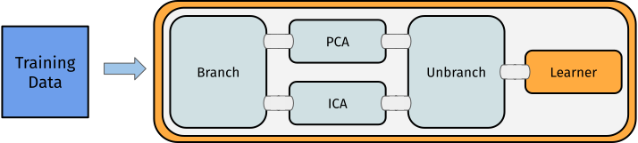
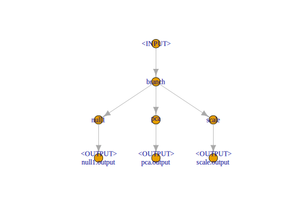
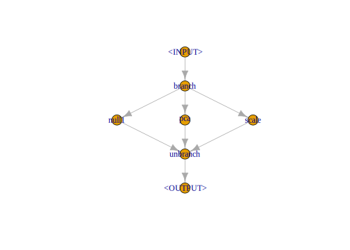
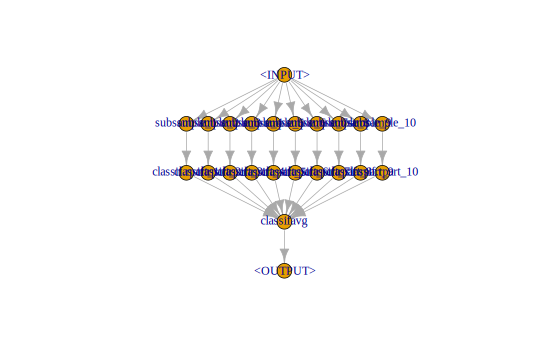
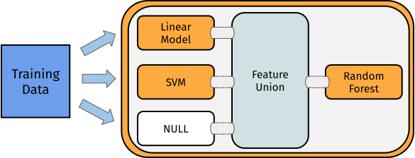
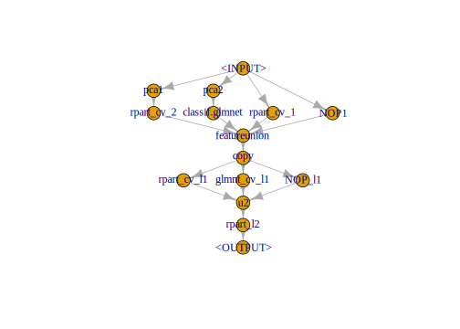

## Non-Linear Graphs {#pipe-nonlinear}


The Graphs seen so far all have a linear structure.
Some POs may have multiple input or output channels.
These channels make it possible to create non-linear Graphs with alternative paths taken by the data.

Possible types are:

- [Branching](#pipe-model-ensembles-branching):
  Splitting of a node into several paths, e.g. useful when comparing multiple feature-selection methods (pca, filters).
  Only one path will be executed.
- [Copying](#pipe-model-ensembles-copying):
  Splitting of a node into several paths, all paths will be executed (sequentially).
  Parallel execution is not yet supported.
- [Stacking](#pipe-model-ensembles-stacking):
  Single graphs are stacked onto each other, i.e. the output of one [`Graph`](https://mlr3pipelines.mlr-org.com/reference/Graph.html) is the input for another.
  In machine learning this means that the prediction of one [`Graph`](https://mlr3pipelines.mlr-org.com/reference/Graph.html) is used as input for another [`Graph`](https://mlr3pipelines.mlr-org.com/reference/Graph.html)

### Branching & Copying {#pipe-model-ensembles-branching-copying}

The [`PipeOpBranch`](https://mlr3pipelines.mlr-org.com/reference/mlr_pipeops_branch.html)  and [`PipeOpUnbranch`](https://mlr3pipelines.mlr-org.com/reference/mlr_pipeops_unbranch.html)  POs make it possible to specify multiple alternative paths.
Only one path is actually executed, the others are ignored.
The active path is determined by a hyperparameter.
This concept makes it possible to tune alternative preprocessing paths (or learner models).

Below a conceptual visualization of branching:



`PipeOp(Un)Branch` is initialized either with the number of branches, or with a `character`-vector indicating the names of the branches.
If names are given, the "branch-choosing" hyperparameter becomes more readable.
In the following, we set three options:

1. Doing nothing ("nop")
2. Applying a PCA
3. Scaling the data

It is important to "unbranch" again after "branching", so that the outputs are merged into one result objects.

In the following we first create the branched graph and then show what happens if the "unbranching" is not applied:


```r
graph = mlr_pipeops$get("branch", c("nop", "pca", "scale")) %>>%
  gunion(list(
      mlr_pipeops$get("nop", id = "null1"),
      mlr_pipeops$get("pca"),
      mlr_pipeops$get("scale")
  ))
```

Without "unbranching" one creates the following graph:


```r
graph$plot(html = FALSE)
```



Now when "unbranching", we obtain the following results:


```r
(graph %>>% mlr_pipeops$get("unbranch", c("nop", "pca", "scale")))$plot(html = FALSE)
```



The same can be achieved using a shorter notation:


```r
# List of pipeops
opts = list(po("nop", "no_op"), po("pca"), po("scale"))
# List of po ids
opt_ids = mlr3misc::map_chr(opts, `[[`, "id")
po("branch", options = opt_ids) %>>%
  gunion(opts) %>>%
  po("unbranch", options = opt_ids)
```

```
## Graph with 5 PipeOps:
##        ID         State        sccssors       prdcssors
##    branch <<UNTRAINED>> no_op,pca,scale                
##     no_op <<UNTRAINED>>        unbranch          branch
##       pca <<UNTRAINED>>        unbranch          branch
##     scale <<UNTRAINED>>        unbranch          branch
##  unbranch <<UNTRAINED>>                 no_op,pca,scale
```

### Model Ensembles {#pipe-model-ensembles}

We can leverage the different operations presented to connect POs.
This allows us to form powerful graphs.

Before we go into details, we split the task into train and test indices.


```r
task = mlr_tasks$get("iris")
train.idx = sample(seq_len(task$nrow), 120)
test.idx = setdiff(seq_len(task$nrow), train.idx)
```

#### Bagging {#pipe-model-ensembles-bagging}

We first examine Bagging introduced by [@Breiman1996].
The basic idea is to create multiple predictors and then aggregate those to a single, more powerful predictor.

> "... multiple versions are formed
> by making bootstrap replicates of the learning set
> and using these as new learning sets" [@Breiman1996]

Bagging then aggregates a set of predictors by averaging (regression) or majority vote (classification).
The idea behind bagging is, that a set of weak, but different predictors can be combined in order to arrive at a single, better predictor.

We can achieve this by downsampling our data before training a learner, repeating this e.g. 10 times and then performing a majority vote on the predictions.
Graphically, it may be summarized as follows:


First, we create a simple pipeline, that uses [`PipeOpSubsample`](https://mlr3pipelines.mlr-org.com/reference/mlr_pipeops_subsample.html) before a [`PipeOpLearner`](https://mlr3pipelines.mlr-org.com/reference/mlr_pipeops_learner.html) is trained:


```r
single_pred = PipeOpSubsample$new(param_vals = list(frac = 0.7)) %>>%
  PipeOpLearner$new(mlr_learners$get("classif.rpart"))
```

We can now copy this operation 10 times using [`pipeline_greplicate`](https://mlr3pipelines.mlr-org.com/reference/pipeline_greplicate.html).
The [`pipeline_greplicate`](https://mlr3pipelines.mlr-org.com/reference/pipeline_greplicate.html) allows us to parallelize many copies of an operation by creating a Graph containing `n` copies of the input Graph.
We can also create it using  **syntactic sugar** via `ppl()`:


```r
pred_set = ppl("greplicate", single_pred, 10L)
```

Afterwards we need to aggregate the 10 pipelines to form a single model:


```r
bagging = pred_set %>>%
  PipeOpClassifAvg$new(innum = 10L)
```

Now we can plot again to see what happens:


```r
bagging$plot(html = FALSE)
```



This pipeline can again be used in conjunction with [`GraphLearner`](https://mlr3pipelines.mlr-org.com/reference/mlr_learners_graph.html)  in order for Bagging to be used like a [`Learner`](https://mlr3.mlr-org.com/reference/Learner.html):


```r
baglrn = GraphLearner$new(bagging)
baglrn$train(task, train.idx)
baglrn$predict(task, test.idx)
```

```
## <PredictionClassif> for 30 observations:
##     row_id     truth   response prob.setosa prob.versicolor prob.virginica
##          6    setosa     setosa           1             0.0            0.0
##         11    setosa     setosa           1             0.0            0.0
##         14    setosa     setosa           1             0.0            0.0
## ---                                                                       
##        130 virginica versicolor           0             0.6            0.4
##        140 virginica  virginica           0             0.0            1.0
##        141 virginica  virginica           0             0.0            1.0
```

In conjunction with different `Backends`, this can be a very powerful tool.
In cases when the data does not fully fit in memory, one can obtain a fraction of the data for each learner from a [`DataBackend`](https://mlr3.mlr-org.com/reference/DataBackend.html)  and then aggregate predictions over all learners.

#### Stacking {#pipe-model-ensembles-stacking}

Stacking [@Wolpert1992] is another technique that can improve model performance.
The basic idea behind stacking is the use of predictions from one model as features for a subsequent model to possibly improve performance.

Below an conceptual illustration of stacking:



As an example we can train a decision tree and use the predictions from this model in conjunction with the original features in order to train an additional model on top.

To limit overfitting, we additionally do not predict on the original predictions of the learner.
Instead, we predict on out-of-bag predictions.
To do all this, we can use [`PipeOpLearnerCV`](https://mlr3pipelines.mlr-org.com/reference/mlr_pipeops_learner_cv.html) .

[`PipeOpLearnerCV`](https://mlr3pipelines.mlr-org.com/reference/mlr_pipeops_learner_cv.html)  performs nested cross-validation on the training data, fitting a model in each fold.
Each of the models is then used to predict on the out-of-fold data.
As a result, we obtain predictions for every data point in our input data.

We first create a "level 0" learner, which is used to extract a lower level prediction.
Additionally, we `clone()` the learner object to obtain a copy of the learner.
Subsequently, one sets a custom id for the [`PipeOp`](https://mlr3pipelines.mlr-org.com/reference/PipeOp.html) .


```r
lrn = mlr_learners$get("classif.rpart")
lrn_0 = PipeOpLearnerCV$new(lrn$clone())
lrn_0$id = "rpart_cv"
```

We use [`PipeOpNOP`](https://mlr3pipelines.mlr-org.com/reference/mlr_pipeops_nop.html)  in combination with [`gunion`](https://mlr3pipelines.mlr-org.com/reference/gunion.html), in order to send the unchanged Task to the next level.
There it is combined with the predictions from our decision tree learner.


```r
level_0 = gunion(list(lrn_0, PipeOpNOP$new()))
```

Afterwards, we want to concatenate the predictions from [`PipeOpLearnerCV`](https://mlr3pipelines.mlr-org.com/reference/mlr_pipeops_learner_cv.html)  and the original Task using [`PipeOpFeatureUnion`](https://mlr3pipelines.mlr-org.com/reference/mlr_pipeops_featureunion.html) :


```r
combined = level_0 %>>% PipeOpFeatureUnion$new(2)
```

Now we can train another learner on top of the combined features:


```r
stack = combined %>>% PipeOpLearner$new(lrn$clone())
stack$plot(html = FALSE)
```


```r
stacklrn = GraphLearner$new(stack)
stacklrn$train(task, train.idx)
stacklrn$predict(task, test.idx)
```

In this vignette, we showed a very simple use-case for stacking.
In many real-world applications, stacking is done for multiple levels and on multiple representations of the dataset.
On a lower level, different preprocessing methods can be defined in conjunction with several learners.
On a higher level, we can then combine those predictions in order to form a very powerful model.

#### Multilevel Stacking

In order to showcase the power of [mlr3pipelines](https://mlr3pipelines.mlr-org.com), we will show a more complicated stacking example.

In this case, we train a `glmnet` and 2 different `rpart` models (some transform its inputs using [`PipeOpPCA`](https://mlr3pipelines.mlr-org.com/reference/mlr_pipeops_pca.html) ) on our task in the "level 0" and concatenate them with the original features (via [`gunion`](https://mlr3pipelines.mlr-org.com/reference/gunion.html)).
The result is then passed on to "level 1", where we copy the concatenated features 3 times and put this task into an `rpart` and a `glmnet` model.
Additionally, we keep a version of the "level 0" output (via [`PipeOpNOP`](https://mlr3pipelines.mlr-org.com/reference/mlr_pipeops_nop.html)) and pass this on to "level 2".
In "level 2" we simply concatenate all "level 1" outputs and train a final decision tree.

In the following examples, use `<lrn>$param_set$values$<param_name> = <param_value>` to set hyperparameters
for the different learner.


```r
library("magrittr")
library("mlr3learners") # for classif.glmnet

rprt = lrn("classif.rpart", predict_type = "prob")
glmn = lrn("classif.glmnet", predict_type = "prob")

#  Create Learner CV Operators
lrn_0 = PipeOpLearnerCV$new(rprt, id = "rpart_cv_1")
lrn_0$param_set$values$maxdepth = 5L
lrn_1 = PipeOpPCA$new(id = "pca1") %>>% PipeOpLearnerCV$new(rprt, id = "rpart_cv_2")
lrn_1$param_set$values$rpart_cv_2.maxdepth = 1L
lrn_2 = PipeOpPCA$new(id = "pca2") %>>% PipeOpLearnerCV$new(glmn)

# Union them with a PipeOpNULL to keep original features
level_0 = gunion(list(lrn_0, lrn_1,lrn_2, PipeOpNOP$new(id = "NOP1")))

# Cbind the output 3 times, train 2 learners but also keep level
# 0 predictions
level_1 = level_0 %>>%
  PipeOpFeatureUnion$new(4) %>>%
  PipeOpCopy$new(3) %>>%
  gunion(list(
    PipeOpLearnerCV$new(rprt, id = "rpart_cv_l1"),
    PipeOpLearnerCV$new(glmn, id = "glmnt_cv_l1"),
    PipeOpNOP$new(id = "NOP_l1")
  ))

# Cbind predictions, train a final learner
level_2 = level_1 %>>%
  PipeOpFeatureUnion$new(3, id = "u2") %>>%
  PipeOpLearner$new(rprt,
    id = "rpart_l2")

# Plot the resulting graph
level_2$plot(html = FALSE)
```



```r
task = tsk("iris")
lrn = GraphLearner$new(level_2)
```

And we can again call `.$train` and `.$predict`:


```r
lrn$
  train(task, train.idx)$
  predict(task, test.idx)$
  score()
```

```
## classif.ce 
##          0
```
