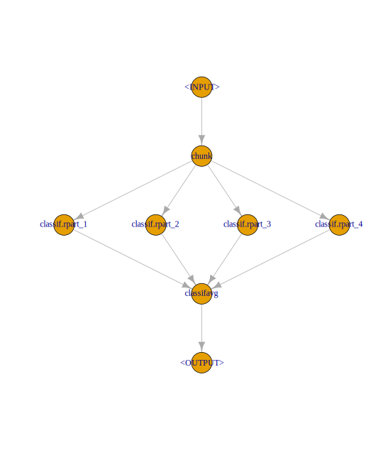

## Special Operators {#pipe-special-ops}


This section introduces some special operators, that might be useful in numerous further applications.

### Imputation: `PipeOpImpute`

An often occurring setting is the imputation of missing data.
Imputation methods range from relatively simple imputation using either *mean*, *median* or histograms to way more involved methods including using machine learning algorithms in order to predict missing values.

The following `PipeOp`s, [`PipeOpImpute`](https://mlr3pipelines.mlr-org.com/reference/PipeOpImpute.html):

- Impute numeric values from a histogram
- Adds a new level for factors
- Add a column marking whether a value for a given feature was missing or not (numeric only)
- We use `po("featureunion")` to cbind the missing indicator features.


```r
pom = PipeOpMissInd$new()
pon = PipeOpImputeHist$new(id = "imputer_num", param_vals = list(affect_columns = is.numeric))
pof = PipeOpImputeOOR$new(id = "imputer_fct", param_vals = list(affect_columns = is.factor))
imputer = pom %>>% pon %>>% pof
```

A learner can thus be equipped with automatic imputation of missing values by adding an imputation Pipeop.


```r
polrn = PipeOpLearner$new(mlr_learners$get("classif.rpart"))
lrn = GraphLearner$new(graph = imputer %>>% polrn)
```

### Feature Engineering: `PipeOpMutate`

New features can be added or computed from a task using [`PipeOpMutate`](https://mlr3pipelines.mlr-org.com/reference/mlr_pipeops_mutate.html) .
The operator evaluates one or multiple expressions provided in an `alist`.
In this example, we compute some new features on top of the `iris` task.
Then we add them to the data as illustrated below:


```r
pom = PipeOpMutate$new()

# Define a set of mutations
mutations = list(
  Sepal.Sum = ~ Sepal.Length + Sepal.Width,
  Petal.Sum = ~ Petal.Length + Petal.Width,
  Sepal.Petal.Ratio = ~ (Sepal.Length / Petal.Length)
)
pom$param_set$values$mutation = mutations
```

If outside data is required, we can make use of the `env` parameter.
Moreover, we provide an environment, where expressions are evaluated (`env` defaults to `.GlobalEnv`).

### Training on data subsets: `PipeOpChunk`

In cases, where data is too big to fit into the machine's memory, an often-used technique is to split the data into several parts.
Subsequently, the parts are trained on each part of the data.

After undertaking these steps, we aggregate the models.
In this example, we split our data into 4 parts using [`PipeOpChunk`](https://mlr3pipelines.mlr-org.com/reference/mlr_pipeops_chunk.html) .
Additionally, we create 4 [`PipeOpLearner`](https://mlr3pipelines.mlr-org.com/reference/mlr_pipeops_learner.html)  POS, which are then trained on each split of the data.


```r
chks = PipeOpChunk$new(4)
lrns = ppl("greplicate", PipeOpLearner$new(mlr_learners$get("classif.rpart")), 4)
```

Afterwards we can use [`PipeOpClassifAvg`](https://mlr3pipelines.mlr-org.com/reference/mlr_pipeops_classifavg.html)  to aggregate the predictions from the 4 different models into a new one.


```r
mjv = PipeOpClassifAvg$new(4)
```

We can now connect the different operators and visualize the full graph:


```r
pipeline = chks %>>% lrns %>>% mjv
pipeline$plot(html = FALSE)
```




```r
task = mlr_tasks$get("iris")
train.idx = sample(seq_len(task$nrow), 120)
test.idx = setdiff(seq_len(task$nrow), train.idx)

pipelrn = GraphLearner$new(pipeline)
pipelrn$train(task, train.idx)$
  predict(task, train.idx)$
  score()
```

```
## classif.ce 
##      0.025
```

### Feature Selection: `PipeOpFilter` and `PipeOpSelect`

The package [mlr3filters](https://mlr3filters.mlr-org.com) contains many different [`mlr3filters::Filter`](https://mlr3filters.mlr-org.com/reference/Filter.html)s that can be used to select features for subsequent learners.
This is often required when the data has a large amount of features.


A `PipeOp` for filters is [`PipeOpFilter`](https://mlr3pipelines.mlr-org.com/reference/mlr_pipeops_filter.html):


```r
PipeOpFilter$new(mlr3filters::FilterInformationGain$new())
```

```
## PipeOp: <information_gain> (not trained)
## values: <list()>
## Input channels <name [train type, predict type]>:
##   input [Task,Task]
## Output channels <name [train type, predict type]>:
##   output [Task,Task]
```

How many features to keep can be set using `filter_nfeat`, `filter_frac` and `filter_cutoff`.

Filters can be selected / de-selected by name using [`PipeOpSelect`](https://mlr3pipelines.mlr-org.com/reference/mlr_pipeops_select.html).
