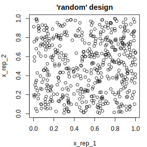
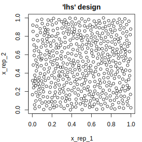

## Parameters (using `paradox`) {#paradox}

The [paradox](https://paradox.mlr-org.com) package offers a language for the description of *parameter spaces*, as well as tools for useful operations on these parameter spaces.
A parameter space is often useful when describing:

* A set of sensible input values for an R function
* The set of possible values that slots of a configuration object can take
* The search space of an optimization process

The tools provided by `paradox` therefore relate to:

* **Parameter checking**: Verifying that a set of parameters satisfies the conditions of a parameter space
* **Parameter sampling**: Generating parameter values that lie in the parameter space for systematic exploration of program behavior depending on these parameters

[paradox](https://paradox.mlr-org.com) is, by nature, an auxiliary package that derives its usefulness from other packages that make use of it.
It is heavily utilized in other [mlr-org](https://github.com/mlr-org) packages such as [mlr3](https://mlr3.mlr-org.com), [mlr3pipelines](https://mlr3pipelines.mlr-org.com), and [mlr3tuning](https://mlr3tuning.mlr-org.com).

### Reference Based Objects

[paradox](https://paradox.mlr-org.com) is the spiritual successor to the [ParamHelpers](https://cran.r-project.org/package=ParamHelpers) package and was written from scratch using the [R6](https://cran.r-project.org/package=R6) class system.
The most important consequence of this is that all objects created in `paradox` are "reference-based", unlike most other objects in R.
When a change is made to a `ParamSet` object, for example by adding a parameter using the `$add()` function, all variables that point to this `ParamSet` will contain the changed object.
To create an independent copy of a `ParamSet`, the `$clone()` method needs to be used:


```r
library("paradox")

ps = ParamSet$new()
ps2 = ps
ps3 = ps$clone(deep = TRUE)
print(ps) # the same for ps2 and ps3
```

```
## <ParamSet>
## Empty.
```


```r
ps$add(ParamLgl$new("a"))
```


```r
print(ps)  # ps was changed
```

```
## <ParamSet>
##    id    class lower upper      levels        default value
## 1:  a ParamLgl    NA    NA  TRUE,FALSE <NoDefault[3]>
```

```r
print(ps2) # contains the same reference as ps
```

```
## <ParamSet>
##    id    class lower upper      levels        default value
## 1:  a ParamLgl    NA    NA  TRUE,FALSE <NoDefault[3]>
```

```r
print(ps3) # is a "clone" of the old (empty) ps
```

```
## <ParamSet>
## Empty.
```

### Defining a Parameter Space

#### Single Parameters

The basic building block for describing parameter spaces is the **`Param`** class.
It represents a single parameter, which usually can take a single atomic value.
Consider, for example, trying to configure the `rpart` package's `rpart.control` object.
It has various components (`minsplit`, `cp`, ...) that all take a single value, and that would all be represented by a different instance of a `Param` object.

The `Param` class has various sub-classes that represent different value types:

* [`ParamInt`](https://paradox.mlr-org.com/reference/ParamInt.html): Integer numbers
* [`ParamDbl`](https://paradox.mlr-org.com/reference/ParamDbl.html): Real numbers
* [`ParamFct`](https://paradox.mlr-org.com/reference/ParamFct.html): String values from a set of possible values, similar to R `factor`s
* [`ParamLgl`](https://paradox.mlr-org.com/reference/ParamLgl.html): Truth values (`TRUE` / `FALSE`), as `logical`s in R
* [`ParamUty`](https://paradox.mlr-org.com/reference/ParamUty.html): Parameter that can take any value

A particular instance of a parameter is created by calling the attached `$new()` function:


```r
library("paradox")
parA = ParamLgl$new(id = "A")
parB = ParamInt$new(id = "B", lower = 0, upper = 10, tags = c("tag1", "tag2"))
parC = ParamDbl$new(id = "C", lower = 0, upper = 4, special_vals = list(NULL))
parD = ParamFct$new(id = "D", levels = c("x", "y", "z"), default = "y")
parE = ParamUty$new(id = "E", custom_check = function(x) checkmate::checkFunction(x))
```

Every parameter must have:

* **id** - A name for the parameter within the parameter set
* **default** - A default value
* **special_vals** - A list of values that are accepted even if they do not conform to the type
* **tags** - Tags that can be used to organize parameters

The numeric (`Int` and `Dbl`) parameters furthermore allow for specification of a **lower** and **upper** bound.
Meanwhile, the `Fct` parameter must be given a vector of **levels** that define the possible states its parameter can take.
The `Uty` parameter can also have a **`custom_check`** function that must return `TRUE` when a value is acceptable and may return a `character(1)` error description otherwise.
The example above defines `parE` as a parameter that only accepts functions.

All values which are given to the constructor are then accessible from the object for inspection using `$`.
Although all these values can be changed for a parameter after construction, this can be a bad idea and should be avoided when possible.

Instead, a new parameter should be constructed.
Besides the possible values that can be given to a constructor, there are also the `$class`, `$nlevels`, `$is_bounded`, `$has_default`, `$storage_type`, `$is_number` and `$is_categ` slots that give information about a parameter.

A list of all slots can be found in [`?Param`](https://paradox.mlr-org.com/reference/Param.html).


```r
parB$lower
```

```
## [1] 0
```

```r
parA$levels
```

```
## [1]  TRUE FALSE
```

```r
parE$class
```

```
## [1] "ParamUty"
```

It is also possible to get all information of a `Param` as `data.table` by calling `as.data.table`.


```r
as.data.table(parA)
```

```
##    id    class lower upper      levels nlevels is_bounded special_vals        default storage_type tags
## 1:  A ParamLgl    NA    NA  TRUE,FALSE       2       TRUE    <list[0]> <NoDefault[3]>      logical
```

##### Type / Range Checking

A `Param` object offers the possibility to check whether a value satisfies its condition, i.e. is of the right type, and also falls within the range of allowed values, using the `$test()`, `$check()`, and `$assert()` functions.
`test()` should be used within conditional checks and returns `TRUE` or `FALSE`, while `check()` returns an error description when a value does not conform to the parameter (and thus plays well with the [`checkmate::assert()`](https://www.rdocumentation.org/packages/checkmate/topics/assert) function).
`assert()` will throw an error whenever a value does not fit.


```r
parA$test(FALSE)
```

```
## [1] TRUE
```

```r
parA$test("FALSE")
```

```
## [1] FALSE
```

```r
parA$check("FALSE")
```

```
## [1] "Must be of type 'logical flag', not 'character'"
```

Instead of testing single parameters, it is often more convenient to check a whole set of parameters using a `ParamSet`.

#### Parameter Sets

The ordered collection of parameters is handled in a `ParamSet`^[Although the name is suggestive of a "Set"-valued `Param`, this is unrelated to the other objects that follow the `ParamXxx` naming scheme.].
It is initialized using the `$new()` function and optionally takes a list of `Param`s as argument.
Parameters can also be added to the constructed `ParamSet` using the `$add()` function.
It is even possible to add whole `ParamSet`s to other `ParamSet`s.


```r
ps = ParamSet$new(list(parA, parB))
ps$add(parC)
ps$add(ParamSet$new(list(parD, parE)))
print(ps)
```

```
## <ParamSet>
##    id    class lower upper      levels        default value
## 1:  A ParamLgl    NA    NA  TRUE,FALSE <NoDefault[3]>      
## 2:  B ParamInt     0    10             <NoDefault[3]>      
## 3:  C ParamDbl     0     4             <NoDefault[3]>      
## 4:  D ParamFct    NA    NA       x,y,z              y      
## 5:  E ParamUty    NA    NA             <NoDefault[3]>
```

The individual parameters can be accessed through the `$params` slot.
It is also possible to get information about all parameters in a vectorized fashion using mostly the same slots as for individual `Param`s (i.e. `$class`, `$levels` etc.), see `?ParamSet` for details.

It is possible to reduce `ParamSet`s using the **`$subset`** method.
Be aware that it modifies a ParamSet in-place, so a "clone" must be created first if the original `ParamSet` should not be modified.


```r
psSmall = ps$clone()
psSmall$subset(c("A", "B", "C"))
print(psSmall)
```

```
## <ParamSet>
##    id    class lower upper      levels        default value
## 1:  A ParamLgl    NA    NA  TRUE,FALSE <NoDefault[3]>      
## 2:  B ParamInt     0    10             <NoDefault[3]>      
## 3:  C ParamDbl     0     4             <NoDefault[3]>
```

Just as for `Param`s, and much more useful, it is possible to get the `ParamSet` as a `data.table` using `as.data.table()`.
This makes it easy to subset parameters on certain conditions and aggregate information about them, using the variety of methods provided by `data.table`.


```r
as.data.table(ps)
```

```
##    id    class lower upper      levels nlevels is_bounded special_vals        default storage_type      tags
## 1:  A ParamLgl    NA    NA  TRUE,FALSE       2       TRUE    <list[0]> <NoDefault[3]>      logical          
## 2:  B ParamInt     0    10                  11       TRUE    <list[0]> <NoDefault[3]>      integer tag1,tag2
## 3:  C ParamDbl     0     4                 Inf       TRUE    <list[1]> <NoDefault[3]>      numeric          
## 4:  D ParamFct    NA    NA       x,y,z       3       TRUE    <list[0]>              y    character          
## 5:  E ParamUty    NA    NA                 Inf      FALSE    <list[0]> <NoDefault[3]>         list
```

##### Type / Range Checking

Similar to individual `Param`s, the `ParamSet` provides `$test()`, `$check()` and `$assert()` functions that allow for type and range checking of parameters.
Their argument must be a named list with values that are checked against the respective parameters.
It is possible to check only a subset of parameters.


```r
ps$check(list(A = TRUE, B = 0, E = identity))
```

```
## [1] TRUE
```

```r
ps$check(list(A = 1))
```

```
## [1] "A: Must be of type 'logical flag', not 'double'"
```

```r
ps$check(list(Z = 1))
```

```
## [1] "Parameter 'Z' not available. Did you mean 'A' / 'B' / 'C'?"
```

##### Values in a `ParamSet`

Although a `ParamSet` fundamentally represents a value space, it also has a slot `$values` that can contain a point within that space.
This is useful because many things that define a parameter space need similar operations (like parameter checking) that can be simplified.
The `$values` slot contains a named list that is always checked against parameter constraints.
When trying to set parameter values, e.g. for `mlr3` `Learner`s, it is the `$values` slot of its `$param_set` that needs to be used.


```r
ps$values = list(A = TRUE, B = 0)
ps$values$B = 1
print(ps$values)
```

```
## $A
## [1] TRUE
## 
## $B
## [1] 1
```

The parameter constraints are automatically checked:


```r
ps$values$B = 100
```

```
## Error in self$assert(xs): Assertion on 'xs' failed: B: Element 1 is not <= 10.
```

##### Dependencies

It is often the case that certain parameters are irrelevant or should not be given depending on values of other parameters.
An example would be a parameter that switches a certain algorithm feature (for example regularization) on or off, combined with another parameter that controls the behavior of that feature (e.g. a regularization parameter).
The second parameter would be said to *depend* on the first parameter having the value `TRUE`.

A dependency can be added using the `$add_dep` method, which takes both the ids of the "depender" and "dependee" parameters as well as a `Condition` object.
The `Condition` object represents the check to be performed on the "dependee".
Currently it can be created using `CondEqual$new()` and `CondAnyOf$new()`.
Multiple dependencies can be added, and parameters that depend on others can again be depended on, as long as no cyclic dependencies are introduced.

The consequence of dependencies are twofold:
For one, the `$check()`, `$test()` and `$assert()` tests will not accept the presence of a parameter if its dependency is not met.
Furthermore, when sampling or creating grid designs from a `ParamSet`, the dependencies will be respected (see [Parameter Sampling](#parameter-sampling), in particular [Hierarchical Sampler](#hierarchical-sampler)).

The following example makes parameter `D` depend on parameter `A` being `FALSE`, and parameter `B` depend on parameter `D` being one of `"x"` or `"y"`.
This introduces an implicit dependency of `B` on `A` being `FALSE` as well, because `D` does not take any value if `A` is `TRUE`.


```r
ps$add_dep("D", "A", CondEqual$new(FALSE))
ps$add_dep("B", "D", CondAnyOf$new(c("x", "y")))
```


```r
ps$check(list(A = FALSE, D = "x", B = 1))          # OK: all dependencies met
```

```
## [1] TRUE
```

```r
ps$check(list(A = FALSE, D = "z", B = 1))          # B's dependency is not met
```

```
## [1] "The parameter 'B' can only be set if the following condition is met 'D ∈ {x, y}'. Instead the current parameter value is: D=z"
```

```r
ps$check(list(A = FALSE, B = 1))                   # B's dependency is not met
```

```
## [1] "The parameter 'B' can only be set if the following condition is met 'D ∈ {x, y}'. Instead the parameter value for 'D' is not set at all. Try setting 'D' to a value that satisfies the condition"
```

```r
ps$check(list(A = FALSE, D = "z"))                 # OK: B is absent
```

```
## [1] TRUE
```

```r
ps$check(list(A = TRUE))                           # OK: neither B nor D present
```

```
## [1] TRUE
```

```r
ps$check(list(A = TRUE, D = "x", B = 1))           # D's dependency is not met
```

```
## [1] "The parameter 'D' can only be set if the following condition is met 'A = FALSE'. Instead the current parameter value is: A=TRUE"
```

```r
ps$check(list(A = TRUE, B = 1))                    # B's dependency is not met
```

```
## [1] "The parameter 'B' can only be set if the following condition is met 'D ∈ {x, y}'. Instead the parameter value for 'D' is not set at all. Try setting 'D' to a value that satisfies the condition"
```

Internally, the dependencies are represented as a `data.table`, which can be accessed listed in the **`$deps`** slot.
This `data.table` can even be mutated, to e.g. remove dependencies.
There are no sanity checks done when the `$deps` slot is changed this way.
Therefore it is advised to be cautious.


```r
ps$deps
```

```
##    id on           cond
## 1:  D  A <CondEqual[9]>
## 2:  B  D <CondAnyOf[9]>
```

#### Vector Parameters

Unlike in the old `ParamHelpers` package, there are no more vectorial parameters in `paradox`.
Instead, it is now possible to create multiple copies of a single parameter using the `$rep` function.
This creates a `ParamSet` consisting of multiple copies of the parameter, which can then (optionally) be added to another `ParamSet`.


```r
ps2d = ParamDbl$new("x", lower = 0, upper = 1)$rep(2)
print(ps2d)
```

```
## <ParamSet>
##         id    class lower upper levels        default value
## 1: x_rep_1 ParamDbl     0     1        <NoDefault[3]>      
## 2: x_rep_2 ParamDbl     0     1        <NoDefault[3]>
```


```r
ps$add(ps2d)
print(ps)
```

```
## <ParamSet>
##         id    class lower upper      levels        default parents value
## 1:       A ParamLgl    NA    NA  TRUE,FALSE <NoDefault[3]>          TRUE
## 2:       B ParamInt     0    10             <NoDefault[3]>       D     1
## 3:       C ParamDbl     0     4             <NoDefault[3]>              
## 4:       D ParamFct    NA    NA       x,y,z              y       A      
## 5:       E ParamUty    NA    NA             <NoDefault[3]>              
## 6: x_rep_1 ParamDbl     0     1             <NoDefault[3]>              
## 7: x_rep_2 ParamDbl     0     1             <NoDefault[3]>
```

It is also possible to use a `ParamUty` to accept vectorial parameters, which also works for parameters of variable length.
A `ParamSet` containing a `ParamUty` can be used for parameter checking, but not for [sampling](#parameter-sampling).
To sample values for a method that needs a vectorial parameter, it is advised to use a [parameter transformation](#transformation-between-types) function that creates a vector from atomic values.

Assembling a vector from repeated parameters is aided by the parameter's `$tags`: Parameters that were generated by the `$rep()` command automatically get tagged as belonging to a group of repeated parameters.


```r
ps$tags
```

```
## $A
## character(0)
## 
## $B
## [1] "tag1" "tag2"
## 
## $C
## character(0)
## 
## $D
## character(0)
## 
## $E
## character(0)
## 
## $x_rep_1
## [1] "x_rep"
## 
## $x_rep_2
## [1] "x_rep"
```


### Parameter Sampling

It is often useful to have a list of possible parameter values that can be systematically iterated through, for example to find parameter values for which an algorithm performs particularly well (tuning).
`paradox` offers a variety of functions that allow creating evenly-spaced parameter values in a "grid" design as well as random sampling.
In the latter case, it is possible to influence the sampling distribution in more or less fine detail.

A point to always keep in mind while sampling is that only numerical and factorial parameters that are bounded can be sampled from, i.e. not `ParamUty`.
Furthermore, for most samplers `ParamInt` and `ParamDbl` must have finite lower and upper bounds.

#### Parameter Designs

Functions that sample the parameter space fundamentally return an object of the `Design` class.
These objects contain the sampled data as a `data.table` under the `$data` slot, and also offer conversion to a list of parameter-values using the **`$transpose()`** function.

#### Grid Design

The `generate_design_grid()` function is used to create grid designs that contain all combinations of parameter values: All possible values for `ParamLgl` and `ParamFct`, and values with a given resolution for `ParamInt` and `ParamDbl`.
The resolution can be given for all numeric parameters, or for specific named parameters through the `param_resolutions` parameter.


```r
design = generate_design_grid(psSmall, 2)
print(design)
```

```
## <Design> with 8 rows:
##        A  B C
## 1:  TRUE  0 0
## 2:  TRUE  0 4
## 3:  TRUE 10 0
## 4:  TRUE 10 4
## 5: FALSE  0 0
## 6: FALSE  0 4
## 7: FALSE 10 0
## 8: FALSE 10 4
```


```r
generate_design_grid(psSmall, param_resolutions = c(B = 1, C = 2))
```

```
## <Design> with 4 rows:
##    B C     A
## 1: 0 0  TRUE
## 2: 0 0 FALSE
## 3: 0 4  TRUE
## 4: 0 4 FALSE
```

#### Random Sampling

`paradox` offers different methods for random sampling, which vary in the degree to which they can be configured.
The easiest way to get a uniformly random sample of parameters is `generate_design_random`.
It is also possible to create "[latin hypercube](https://en.wikipedia.org/wiki/Latin_hypercube_sampling)" sampled parameter values using **`generate_design_lhs`**, which utilizes the [lhs](https://cran.r-project.org/package=lhs) package.
LHS-sampling creates low-discrepancy sampled values that cover the parameter space more evenly than purely random values.


```r
pvrand = generate_design_random(ps2d, 500)
pvlhs = generate_design_lhs(ps2d, 500)
```



#### Generalized Sampling: The `Sampler` Class

It may sometimes be desirable to configure parameter sampling in more detail.
`paradox` uses the `Sampler` abstract base class for sampling, which has many different sub-classes that can be parameterized and combined to control the sampling process.
It is even possible to create further sub-classes of the `Sampler` class (or of any of *its* subclasses) for even more possibilities.

Every `Sampler` object has a `sample()` function, which takes one argument, the number of instances to sample, and returns a [`Design`](#parameter-designs) object.

##### 1D-Samplers

There is a variety of samplers that sample values for a single parameter.
These are `Sampler1DUnif` (uniform sampling), `Sampler1DCateg` (sampling for categorical parameters), `Sampler1DNormal` (normally distributed sampling, truncated at parameter bounds), and `Sampler1DRfun` (arbitrary 1D sampling, given a random-function).
These are initialized with a single `Param`, and can then be used to sample values.


```r
sampA = Sampler1DCateg$new(parA)
sampA$sample(5)
```

```
## <Design> with 5 rows:
##        A
## 1: FALSE
## 2:  TRUE
## 3:  TRUE
## 4: FALSE
## 5: FALSE
```

##### Hierarchical Sampler

The `SamplerHierarchical` sampler is an auxiliary sampler that combines many 1D-Samplers to get a combined distribution.
Its name "hierarchical" implies that it is able to respect parameter dependencies.
This suggests that parameters only get sampled when their dependencies are met.

The following example shows how this works: The `Int` parameter `B` depends on the `Lgl` parameter `A` being `TRUE`.
`A` is sampled to be `TRUE` in about half the cases, in which case `B` takes a value between 0 and 10.
In the cases where `A` is `FALSE`, `B` is set to `NA`.


```r
psSmall$add_dep("B", "A", CondEqual$new(TRUE))
sampH = SamplerHierarchical$new(psSmall,
  list(Sampler1DCateg$new(parA),
    Sampler1DUnif$new(parB),
    Sampler1DUnif$new(parC))
)
sampled = sampH$sample(1000)
table(sampled$data[, c("A", "B")], useNA = "ifany")
```

```
##        B
## A         0   1   2   3   4   5   6   7   8   9  10 <NA>
##   FALSE   0   0   0   0   0   0   0   0   0   0   0  489
##   TRUE   46  46  51  47  47  46  42  44  47  45  50    0
```

##### Joint Sampler

Another way of combining samplers is the `SamplerJointIndep`.
`SamplerJointIndep` also makes it possible to combine `Sampler`s that are not 1D.
However, `SamplerJointIndep` currently can not handle `ParamSet`s with dependencies.


```r
sampJ = SamplerJointIndep$new(
  list(Sampler1DUnif$new(ParamDbl$new("x", 0, 1)),
    Sampler1DUnif$new(ParamDbl$new("y", 0, 1)))
)
sampJ$sample(5)
```

```
## <Design> with 5 rows:
##         x      y
## 1: 0.5955 0.6202
## 2: 0.8824 0.8642
## 3: 0.5691 0.6143
## 4: 0.4402 0.3402
## 5: 0.8272 0.4745
```

##### SamplerUnif

The `Sampler` used in `generate_design_random` is the `SamplerUnif` sampler, which corresponds to a `HierarchicalSampler` of `Sampler1DUnif` for all parameters.

### Parameter Transformation

While the different `Sampler`s allow for a wide specification of parameter distributions, there are cases where the simplest way of getting a desired distribution is to sample parameters from a simple distribution (such as the uniform distribution) and then transform them.
This can be done by assigning a function to the `$trafo` slot of a `ParamSet`.
The `$trafo` function is called with two parameters:

* The list of parameter values to be transformed as `x`
* The `ParamSet` itself as `param_set`

The `$trafo` function must return a list of transformed parameter values.

The transformation is performed when calling the `$transpose` function of the `Design` object returned by a `Sampler` with the `trafo` ParamSet to `TRUE` (the default).
The following, for example, creates a parameter that is exponentially distributed:


```r
psexp = ParamSet$new(list(ParamDbl$new("par", 0, 1)))
psexp$trafo = function(x, param_set) {
  x$par = -log(x$par)
  x
}
design = generate_design_random(psexp, 2)
print(design)
```

```
## <Design> with 2 rows:
##       par
## 1: 0.4381
## 2: 0.6073
```

```r
design$transpose()  # trafo is TRUE
```

```
## [[1]]
## [[1]]$par
## [1] 0.8253
## 
## 
## [[2]]
## [[2]]$par
## [1] 0.4987
```

Compare this to `$transpose()` without transformation:


```r
design$transpose(trafo = FALSE)
```

```
## [[1]]
## [[1]]$par
## [1] 0.4381
## 
## 
## [[2]]
## [[2]]$par
## [1] 0.6073
```

#### Transformation between Types

Usually the design created with one `ParamSet` is then used to configure other objects that themselves have a `ParamSet` which defines the values they take.
The `ParamSet`s which can be used for random sampling, however, are restricted in some ways:
They must have finite bounds, and they may not contain "untyped" (`ParamUty`) parameters.
`$trafo` provides the glue for these situations.
There is relatively little constraint on the trafo function's return value, so it is possible to return values that have different bounds or even types than the original `ParamSet`.
It is even possible to remove some parameters and add new ones.

Suppose, for example, that a certain method requires a *function* as a parameter.
Let's say a function that summarizes its data in a certain way.
The user can pass functions like `median()` or `mean()`, but could also pass quantiles or something completely different.
This method would probably use the following `ParamSet`:


```r
methodPS = ParamSet$new(
  list(
    ParamUty$new("fun",
      custom_check = function(x) checkmate::checkFunction(x, nargs = 1))
  )
)
print(methodPS)
```

```
## <ParamSet>
##     id    class lower upper levels        default value
## 1: fun ParamUty    NA    NA        <NoDefault[3]>
```

If one wanted to sample this method, using one of four functions, a way to do this would be:


```r
samplingPS = ParamSet$new(
  list(
    ParamFct$new("fun", c("mean", "median", "min", "max"))
  )
)

samplingPS$trafo = function(x, param_set) {
  # x$fun is a `character(1)`,
  # in particular one of 'mean', 'median', 'min', 'max'.
  # We want to turn it into a function!
  x$fun = get(x$fun, mode = "function")
  x
}
```


```r
design = generate_design_random(samplingPS, 2)
print(design)
```

```
## <Design> with 2 rows:
##       fun
## 1: median
## 2:    max
```

Note that the `Design` only contains the column "`fun`" as a `character` column.
To get a single value as a *function*, the `$transpose` function is used.


```r
xvals = design$transpose()
print(xvals[[1]])
```

```
## $fun
## function (x, na.rm = FALSE, ...) 
## UseMethod("median")
## <bytecode: 0x55deaa99ba18>
## <environment: namespace:stats>
```

We can now check that it fits the requirements set by `methodPS`, and that `fun` it is in fact a function:


```r
methodPS$check(xvals[[1]])
```

```
## [1] "fun: Must have exactly 1 formal arguments, but has 2"
```

```r
xvals[[1]]$fun(1:10)
```

```
## [1] 5.5
```

Imagine now that a different kind of parametrization of the function is desired:
The user wants to give a function that selects a certain quantile, where the quantile is set by a parameter.
In that case the `$transpose` function could generate a function in a different way.
For interpretability, the parameter is called "`quantile`" before transformation, and the "`fun`" parameter is generated on the fly.


```r
samplingPS2 = ParamSet$new(
  list(
    ParamDbl$new("quantile", 0, 1)
  )
)

samplingPS2$trafo = function(x, param_set) {
  # x$quantile is a `numeric(1)` between 0 and 1.
  # We want to turn it into a function!
  list(fun = function(input) quantile(input, x$quantile))
}
```


```r
design = generate_design_random(samplingPS2, 2)
print(design)
```

```
## <Design> with 2 rows:
##    quantile
## 1:   0.3437
## 2:   0.2406
```

The `Design` now contains the column "`quantile`" that will be used by the `$transpose` function to create the `fun` parameter.
We also check that it fits the requirement set by `methodPS`, and that it is a function.


```r
xvals = design$transpose()
print(xvals[[1]])
```

```
## $fun
## function(input) quantile(input, x$quantile)
## <environment: 0x55deaf5306d8>
```

```r
methodPS$check(xvals[[1]])
```

```
## [1] TRUE
```

```r
xvals[[1]]$fun(1:10)
```

```
## 34.37% 
##  4.093
```
