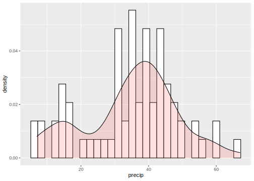
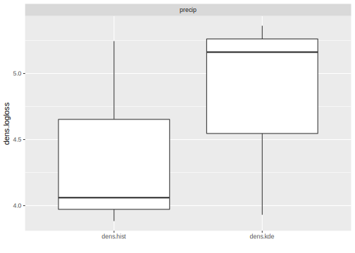

## Density Estimation {#density}

Density estimation is the learning task to find the unknown distribution from which an i.i.d. data set is generated.
We interpret this broadly, with this distribution not necessarily being continuous (so may possess a mass not density).
The conditional case, where a distribution is predicted conditional on covariates, is known as ‘probabilistic supervised regression’, and will be implemented in [mlr3proba](https://mlr3proba.mlr-org.com) in the near-future.
Unconditional density estimation is viewed as an unsupervised task.
For a good overview to density estimation see *Density estimation for statistics and data analysis* [@Silverman1986].

The package [mlr3proba](https://mlr3proba.mlr-org.com) extends [mlr3](https://mlr3.mlr-org.com) with the following objects for density estimation:

* [`TaskDens`](https://mlr3proba.mlr-org.com/reference/TaskDens.html) to define density tasks
* [`LearnerDens`](https://mlr3proba.mlr-org.com/reference/LearnerDens.html) as base class for density estimators
* [`PredictionDens`](https://mlr3proba.mlr-org.com/reference/PredictionDens.html) as specialized class for [`Prediction`](https://mlr3.mlr-org.com/reference/Prediction.html) objects
* [`MeasureDens`](https://mlr3proba.mlr-org.com/reference/MeasureDens.html) as specialized class for performance measures

In this example we demonstrate the basic functionality of the package on the [`faithful`](https://www.rdocumentation.org/packages/datasets/topics/faithful) data from the [datasets](https://cran.r-project.org/package=datasets) package.
This task ships as pre-defined [`TaskDens`](https://mlr3proba.mlr-org.com/reference/TaskDens.html) with [mlr3proba](https://mlr3proba.mlr-org.com).


```r
library("mlr3")
library("mlr3proba")

task = tsk("precip")
print(task)
```

```
## <TaskDens:precip> (70 x 1)
## * Target: -
## * Properties: -
## * Features (1):
##   - dbl (1): precip
```

```r
# histogram and density plot
library("mlr3viz")
autoplot(task, type = "overlay")
```

```
## `stat_bin()` using `bins = 30`. Pick better value with `binwidth`.
```



Unconditional density estimation is an unsupervised method.
Hence, `TaskDens` is an unsupervised task which inherits directly from `Task` unlike `TaskClassif` and `TaskRegr`.
However, `TaskDens` still has a `target` argument and a `$truth` field defined by:

  * `target` - the name of the variable in the data for which to estimate density
  * `$truth` - the values of the `target` column (which is *not* the true density, which is always unknown)

### Train and Predict

Density learners have `train` and `predict` methods, though being unsupervised, 'prediction' is actually 'estimation'.
In training, a [distr6](https://cran.r-project.org/package=distr6) object is created,
[see here](https://alan-turing-institute.github.io/distr6/) for full tutorials on how to access the probability density function, `pdf`, cumulative distribution function, `cdf`, and other important fields and methods.
The predict method is simply a wrapper around `self$model$pdf` and if available `self$model$cdf`, i.e. evaluates the pdf/cdf at given points.
Note that in prediction the points to evaluate the pdf and cdf are determined by the `target` column in the `TaskDens` object used for testing.


```r
# create task and learner

task_faithful = TaskDens$new(id = "eruptions", backend = datasets::faithful$eruptions)
learner = lrn("dens.hist")

# train/test split
train_set = sample(task_faithful$nrow, 0.8 * task_faithful$nrow)
test_set = setdiff(seq_len(task_faithful$nrow), train_set)

# fitting KDE and model inspection
learner$train(task_faithful, row_ids = train_set)
learner$model
```

```
## $distr
## Histogram 
## 
## $hist
## $breaks
## [1] 1.5 2.0 2.5 3.0 3.5 4.0 4.5 5.0 5.5
## 
## $counts
## [1] 39 31  5  7 22 62 47  4
## 
## $density
## [1] 0.35945 0.28571 0.04608 0.06452 0.20276 0.57143 0.43318 0.03687
## 
## $mids
## [1] 1.75 2.25 2.75 3.25 3.75 4.25 4.75 5.25
## 
## $xname
## [1] "dat"
## 
## $equidist
## [1] TRUE
## 
## attr(,"class")
## [1] "histogram"
## 
## attr(,"class")
## [1] "dens.hist"
```

```r
class(learner$model)
```

```
## [1] "dens.hist"
```

```r
# make predictions for new data
prediction = learner$predict(task_faithful, row_ids = test_set)
```

Every `PredictionDens` object can estimate:

  * `pdf` - probability density function

Some learners can estimate:

  * `cdf` - cumulative distribution function

### Benchmark Experiment

Finally, we conduct a small benchmark study on the [`precip`](https://mlr3proba.mlr-org.com/reference/mlr_tasks_precip.html) task using some of the integrated survival learners:


```r
# some integrated learners
learners = lrns(c("dens.hist", "dens.kde"))
print(learners)
```

```
## [[1]]
## <LearnerDensHistogram:dens.hist>
## * Model: -
## * Parameters: list()
## * Packages: distr6
## * Predict Type: pdf
## * Feature types: integer, numeric
## * Properties: -
## 
## [[2]]
## <LearnerDensKDE:dens.kde>
## * Model: -
## * Parameters: kernel=Epan, bandwidth=silver
## * Packages: distr6
## * Predict Type: pdf
## * Feature types: integer, numeric
## * Properties: missings
```

```r
# Logloss for probabilistic predictions
measure = msr("dens.logloss")
print(measure)
```

```
## <MeasureDensLogloss:dens.logloss>
## * Packages: -
## * Range: [0, Inf]
## * Minimize: TRUE
## * Properties: -
## * Predict type: pdf
```

```r
set.seed(1)
bmr = benchmark(benchmark_grid(task, learners, rsmp("cv", folds = 3)))
bmr$aggregate(measure)
```

```
##    nr      resample_result task_id learner_id resampling_id iters dens.logloss
## 1:  1 <ResampleResult[21]>  precip  dens.hist            cv     3        4.396
## 2:  2 <ResampleResult[21]>  precip   dens.kde            cv     3        4.818
```

```r
autoplot(bmr, measure = measure)
```



The results of this experiment show that the sophisticated Penalized Density Estimator does not outperform the baseline Histogram, but that the Kernel Density Estimator has at least consistently `better` (i.e. lower logloss) results.
