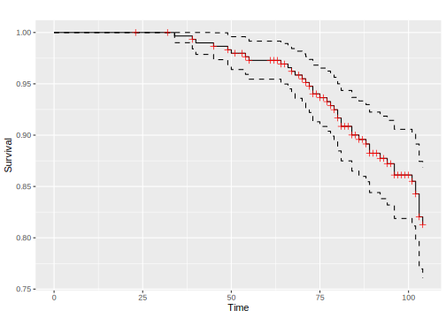
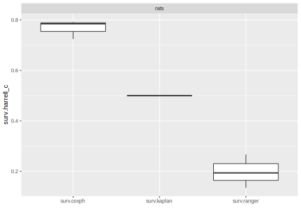

## Survival Analysis {#survival}

Survival analysis is a sub-field of supervised machine learning in which the aim is to predict the survival distribution of a given individual.
Arguably the main feature of survival analysis is that unlike classification and regression, learners are trained on two features:

1. the time until the event takes place
2. the event type: either censoring or death.

At a particular time-point, an individual is either: alive, dead, or censored.
Censoring occurs if it is unknown if an individual is alive or dead.
For example, say we are interested in patients in hospital and every day it is recorded if they are alive or dead, then after a patient leaves it is unknown if they are alive or dead, hence they are censored.
If there was no censoring, then ordinary regression analysis could be used instead.
Furthermore, survival data contains solely positive values and therefore needs to be transformed to avoid biases.

Note that survival analysis accounts for both censored and uncensored observations while adjusting respective model parameters.

The package [mlr3proba](https://mlr3proba.mlr-org.com) extends [mlr3](https://mlr3.mlr-org.com) with the following objects for survival analysis:

* [`TaskSurv`](https://mlr3proba.mlr-org.com/reference/TaskSurv.html) to define (censored) survival tasks
* [`LearnerSurv`](https://mlr3proba.mlr-org.com/reference/LearnerSurv.html) as base class for survival learners
* [`PredictionSurv`](https://mlr3proba.mlr-org.com/reference/PredictionSurv.html) as specialized class for [`Prediction`](https://mlr3.mlr-org.com/reference/Prediction.html) objects
* [`MeasureSurv`](https://mlr3proba.mlr-org.com/reference/MeasureSurv.html) as specialized class for performance measures

For a good introduction to survival analysis see *Modelling Survival Data in Medical Research* [@Collett2014].

### TaskSurv

Unlike `TaskClassif` and `TaskRegr` which have a single 'target' argument, `TaskSurv` mimics the
`survival::Surv` object and has three-four target arguments (dependent on censoring type)


```r
library("mlr3")
library("mlr3proba")
library("survival")

TaskSurv$new(id = "interval_censored", backend = survival::bladder2[,-c(1, 7)],
                    time = "start", time2 = "stop", type = "interval2")
```

```
## <TaskSurv:interval_censored> (178 x 6)
## * Target: start, stop
## * Properties: -
## * Features (4):
##   - dbl (2): enum, rx
##   - int (2): number, size
```

```r
# type = "right" is default
task = TaskSurv$new(id = "right_censored", backend = survival::rats,
             time = "time", event = "status", type = "right")

print(task)
```

```
## <TaskSurv:right_censored> (300 x 5)
## * Target: time, status
## * Properties: -
## * Features (3):
##   - int (1): litter
##   - dbl (1): rx
##   - chr (1): sex
```

```r
# the target column is a survival object:
head(task$truth())
```

```
## [1] 101+  49  104+  91+ 104+ 102+
```

```r
# kaplan-meier plot
library("mlr3viz")
autoplot(task)
```

```
## Registered S3 method overwritten by 'GGally':
##   method from   
##   +.gg   ggplot2
```



### Predict Types - crank, lp, and distr

Every `PredictionSurv` object can predict one or more of:

* `lp` - Linear predictor calculated as the fitted coefficients multiplied by the test data.
* `distr` - Predicted survival distribution, either discrete or continuous. Implemented in [distr6](https://cran.r-project.org/package=distr6).
* `crank` - Continuous risk ranking.

`lp` and `crank` can be used with measures of discrimination such as the concordance index.
Whilst `lp` is a specific mathematical prediction, `crank` is any continuous ranking that identifies who is more or less likely to experience the event.
So far the only implemented learner that only returns a continuous ranking is `surv.svm`.
If a `PredictionSurv` returns an `lp` then the `crank` is identical to this.
Otherwise `crank` is calculated as the expectation of the predicted survival distribution.
Note that for linear proportional hazards models, the ranking (but not necessarily the `crank` score itself) given by `lp` and the expectation of `distr`, is identical.

The example below uses the [`rats`](https://mlr3proba.mlr-org.com/reference/mlr_tasks_rats.html) task shipped with [mlr3proba](https://mlr3proba.mlr-org.com).


```r
task = mlr_tasks$get("rats")
learn = lrn("surv.coxph")

train_set = sample(task$nrow, 0.8 * task$nrow)
test_set = setdiff(seq_len(task$nrow), train_set)

learn$train(task, row_ids = train_set)
prediction = learn$predict(task, row_ids = test_set)

print(prediction)
```

```
## <PredictionSurv> for 60 observations:
##     row_id time status   crank      lp                    distr
##          3  104  FALSE  0.8711  0.8711 <VectorDistribution[60]>
##          5  104  FALSE -2.5385 -2.5385 <VectorDistribution[60]>
##          6  102  FALSE -2.5385 -2.5385 <VectorDistribution[60]>
## ---                                                            
##        293   75   TRUE -1.5681 -1.5681 <VectorDistribution[60]>
##        296  104  FALSE  1.8617  1.8617 <VectorDistribution[60]>
##        300  102  FALSE -1.5479 -1.5479 <VectorDistribution[60]>
```

### Composition

Finally we take a look at the `PipeOp`s implemented in [mlr3proba](https://mlr3proba.mlr-org.com), which are used for composition of predict types.
For example, a predict linear predictor does not have a lot of meaning by itself, but it can be composed into a survival distribution.
See [mlr3pipelines](https://mlr3pipelines.mlr-org.com) for full tutorials and details on `PipeOp`s.


```r
library(mlr3pipelines)
library(mlr3learners)
# PipeOpDistrCompositor - Train one model with a baseline distribution,
# (Kaplan-Meier or Nelson-Aalen), and another with a predicted linear predictor.
task = tsk("rats")
# remove the factor column for support with glmnet
task$select(c("litter", "rx"))
leaner_lp = lrn("surv.glmnet")
leaner_distr = lrn("surv.kaplan")
prediction_lp = leaner_lp$train(task)$predict(task)
prediction_distr = leaner_distr$train(task)$predict(task)
prediction_lp$distr
```

```
## [1] NA
```

```r
# Doesn't need training. Base = baseline distribution. ph = Proportional hazards.

pod = po("compose_distr", param_vals = list(form = "ph", overwrite = FALSE))
prediction = pod$predict(list(base = prediction_distr, pred = prediction_lp))$output

# Now we have a predicted distr!

prediction$distr
```

```
## WeightDisc1 WeightDisc2 ... WeightDisc299 WeightDisc300
```

```r
# This can all be simplified by using the distrcompose pipeline

glm.distr = ppl("distrcompositor", learner = lrn("surv.glmnet"),
                estimator = "kaplan", form = "ph", overwrite = FALSE, graph_learner = TRUE)
glm.distr$train(task)$predict(task)
```

```
## <PredictionSurv> for 300 observations:
##     row_id time status  crank.1     lp.1                    distr
##          1  101  FALSE 0.579315 0.579315 <VectorDistribution[60]>
##          2   49   TRUE 0.004938 0.004938 <VectorDistribution[60]>
##          3  104  FALSE 0.004938 0.004938 <VectorDistribution[60]>
## ---                                                              
##        298   92  FALSE 1.068163 1.068163 <VectorDistribution[60]>
##        299  104  FALSE 0.493786 0.493786 <VectorDistribution[60]>
##        300  102  FALSE 0.493786 0.493786 <VectorDistribution[60]>
```

### Benchmark Experiment

Finally, we conduct a small benchmark study on the [`rats`](https://mlr3proba.mlr-org.com/reference/mlr_tasks_rats.html) task using some of the integrated survival learners:


```r
library(mlr3learners)

task = tsk("rats")

# some integrated learners
learners = lrns(c("surv.coxph", "surv.kaplan", "surv.ranger"))
print(learners)
```

```
## [[1]]
## <LearnerSurvCoxPH:surv.coxph>
## * Model: -
## * Parameters: list()
## * Packages: survival, distr6
## * Predict Type: distr
## * Feature types: logical, integer, numeric, factor
## * Properties: weights
## 
## [[2]]
## <LearnerSurvKaplan:surv.kaplan>
## * Model: -
## * Parameters: list()
## * Packages: survival, distr6
## * Predict Type: crank
## * Feature types: logical, integer, numeric, character, factor, ordered
## * Properties: missings
## 
## [[3]]
## <LearnerSurvRanger:surv.ranger>
## * Model: -
## * Parameters: list()
## * Packages: ranger
## * Predict Type: distr
## * Feature types: logical, integer, numeric, character, factor, ordered
## * Properties: importance, oob_error, weights
```

```r
# Harrell's C-Index for survival
measure = msr("surv.cindex")
print(measure)
```

```
## <MeasureSurvCindex:surv.harrell_c>
## * Packages: -
## * Range: [0, 1]
## * Minimize: FALSE
## * Properties: -
## * Predict type: crank
## * Return type: Score
```

```r
set.seed(1)
bmr = benchmark(benchmark_grid(task, learners, rsmp("cv", folds = 3)))
bmr$aggregate(measure)
```

```
##    nr      resample_result task_id  learner_id resampling_id iters
## 1:  1 <ResampleResult[21]>    rats  surv.coxph            cv     3
## 2:  2 <ResampleResult[21]>    rats surv.kaplan            cv     3
## 3:  3 <ResampleResult[21]>    rats surv.ranger            cv     3
##    surv.harrell_c
## 1:         0.7671
## 2:         0.5000
## 3:         0.1984
```

```r
autoplot(bmr, measure = measure)
```



The experiment indicates that both the Cox PH and the random forest have better discrimination than the Kaplan-Meier baseline estimator, but that the machine learning random forest is not consistently better than the interpretable Cox PH.
