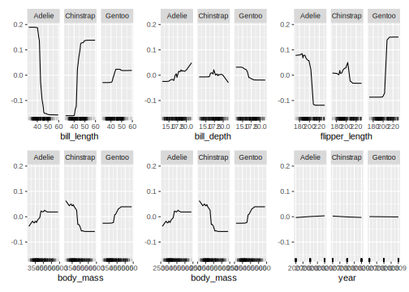
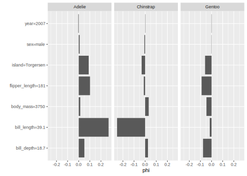
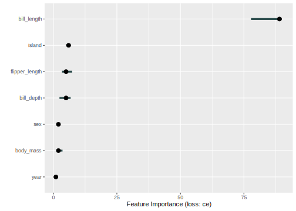
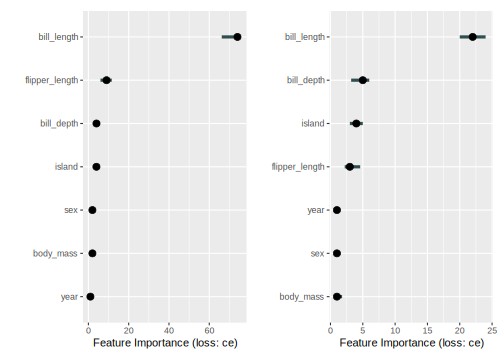
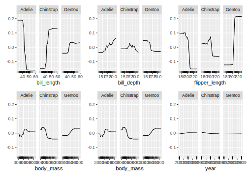
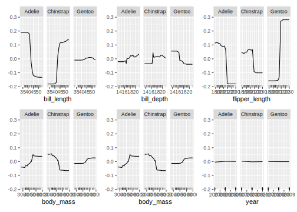

## IML {#iml}

*Author: Shawn Storm*

[iml](https://cran.r-project.org/package=iml) is an R package that interprets the behavior and explains predictions of machine learning models. The functions provided in the [iml](https://cran.r-project.org/package=iml) package are model-agnostic which gives the flexibility to use any machine learning model.

This chapter provides examples of how to use `iml` with `mlr3`. For more information refer to the  [IML github](https://github.com/christophM/iml) and the [IML book](https://christophm.github.io/interpretable-ml-book/)

### Penguin Task

To understand what `iml` can offer, we start off with a thorough example. The goal of this example is to figure out the species of penguins given a set of features. The [`mlr3data::penguins`](https://www.rdocumentation.org/packages/mlr3data/topics/penguins) data set from package [mlr3data](https://mlr3data.mlr-org.com) will be used which is an alternative to the `iris` data set.
The `penguins` data sets contains 8 variables of 344 penguins:


```r
data("penguins", package = "mlr3data")
str(penguins)
```

```
## 'data.frame':	344 obs. of  8 variables:
##  $ species       : Factor w/ 3 levels "Adelie","Chinstrap",..: 1 1 1 1 1 1 1 1 1 1 ...
##  $ island        : Factor w/ 3 levels "Biscoe","Dream",..: 3 3 3 3 3 3 3 3 3 3 ...
##  $ bill_length   : num  39.1 39.5 40.3 NA 36.7 39.3 38.9 39.2 34.1 42 ...
##  $ bill_depth    : num  18.7 17.4 18 NA 19.3 20.6 17.8 19.6 18.1 20.2 ...
##  $ flipper_length: int  181 186 195 NA 193 190 181 195 193 190 ...
##  $ body_mass     : int  3750 3800 3250 NA 3450 3650 3625 4675 3475 4250 ...
##  $ sex           : Factor w/ 2 levels "female","male": 2 1 1 NA 1 2 1 2 NA NA ...
##  $ year          : int  2007 2007 2007 2007 2007 2007 2007 2007 2007 2007 ...
```


To get started run:


```r
library("iml")
library("mlr3")
library("mlr3learners")
set.seed(1)
```


```r
penguins = na.omit(penguins)
task_peng = TaskClassif$new(id = "Species", backend = penguins, target = "species")
```


`penguins = na.omit(penguins)` is to omit the 11 cases with missing values.
If not omitted, there will be an error when running the learner from the data points that have N/A for some features.


```r
learner = mlr_learners$get("classif.ranger")
learner$predict_type = "prob"
learner$train(task_peng)
learner$model
```

```
## Ranger result
## 
## Call:
##  ranger::ranger(dependent.variable.name = task$target_names, data = task$data(),      probability = self$predict_type == "prob", case.weights = task$weights$weight) 
## 
## Type:                             Probability estimation 
## Number of trees:                  500 
## Sample size:                      333 
## Number of independent variables:  7 
## Mtry:                             2 
## Target node size:                 10 
## Variable importance mode:         none 
## Splitrule:                        gini 
## OOB prediction error (Brier s.):  0.0179
```

```r
x = penguins[which(names(penguins) != "species")]
model = Predictor$new(learner, data = x, y = penguins$species)
```

As explained in Section [2.3](https://mlr3book.mlr-org.com/learners.html), specific learners can be queried with `mlr_learners`.
In Section [2.5](https://mlr3book.mlr-org.com/train-predict.html) it is recommended for some classifiers to use the `predict_type` as `prob` instead of directly predicting a label.
This is what is done in this example.
`penguins[which(names(penguins) != "species")]` is the data of all the features and `y` will be the penguins`species`.
`learner$train(task_peng)` trains the model and `learner$model` stores the model from the training command.
`Predictor` holds the machine learning model and the data.
All interpretation methods in `iml` need the machine learning model and the data to be wrapped in the `Predictor` object.

Next is the core functionality of `iml`. In this example three separate interpretation methods will be used: [FeatureEffects](https://github.com/christophM/iml/blob/master/R/FeatureEffects.R), [FeatureImp](https://github.com/christophM/iml/blob/master/R/FeatureImp.R) and [Shapley](https://github.com/christophM/iml/blob/master/R/Shapley.R)


* `FeatureEffects` computes the effects for all given features on the model prediction. Different methods are implemented: [Accumulated Local Effect (ALE) plots](https://christophm.github.io/interpretable-ml-book/ale.html), [Partial Dependence Plots (PDPs)](https://christophm.github.io/interpretable-ml-book/pdp.html) and [Individual Conditional Expectation (ICE) curves](https://christophm.github.io/interpretable-ml-book/ice.html).

* `Shapley` computes feature contributions for single predictions with the Shapley value -- an approach from cooperative game theory ([Shapley Value](https://christophm.github.io/interpretable-ml-book/shapley.html)).

* `FeatureImp` computes the importance of features by calculating the increase in the model's prediction error after permuting the feature (more [here](https://christophm.github.io/interpretable-ml-book/feature-importance.html#feature-importance)).


### FeatureEffects

In addition to the commands above the following two need to be ran:


```r
effect = FeatureEffects$new(model)
plot(effect, features = c("bill_length", "bill_depth", "flipper_length", "body_mass", "body_mass", "year"))
```

<div class="figure" style="text-align: center">

<p class="caption">(\#fig:08-interpretation-iml-005)Plot of the results from FeatureEffects. FeatureEffects computes and plots feature effects of prediction models</p>
</div>

`effect` stores the object from the `FeatureEffect` computation and the results can then be plotted. In this example, all of the features provided by the `penguins` data set were used.


All features except for `year` provide meaningful interpretable information. It should be clear why `year` doesn't provide anything of significance. `bill_length` shows for example that when the bill length is smaller than roughly 40mm, there is a high chance that the penguin is an Adelie.

### Shapley


```r
x = penguins[which(names(penguins) != "species")]
model = Predictor$new(learner, data = penguins, y = "species")
x.interest = data.frame(penguins[1, ])
shapley = Shapley$new(model, x.interest = x.interest)
plot(shapley)
```

<div class="figure" style="text-align: center">

<p class="caption">(\#fig:08-interpretation-iml-006)Plot of the results from Shapley. $\phi$ gives the increase or decrease in probabilty given the values on the vertical axis</p>
</div>

The $\phi$ provides insight into the probability given the values on the vertical axis. For example, a penguin is less likely to be Gentoo if the bill\_depth=18.7 is and much more likely to be Adelie than Chinstrap.


### FeatureImp


```r
effect = FeatureImp$new(model, loss = "ce")
effect$plot(features = c("bill_length","bill_depth", "flipper_length", "body_mass", "body_mass","year"))
```

<div class="figure" style="text-align: center">

<p class="caption">(\#fig:08-interpretation-iml-007)Plot of the results from FeatureImp. FeatureImp visualizes the importance of features given the prediction model</p>
</div>


`FeatureImp` shows the level of importance of the features when classifying the penguins. It is clear to see that the `bill_length` is of high importance and one should concentrate on different boundaries of this feature when attempting to classify the three species.


### Independent Test Data

It is also interesting to see how well the model performs on a test data set. For this section, exactly as was recommended in Section [2.4](https://mlr3book.mlr-org.com/train-predict.html), 80% of the penguin data set will be used for the training set and 20% for the test set:


```r
train_set = sample(task_peng$nrow, 0.8 * task_peng$nrow)
test_set = setdiff(seq_len(task_peng$nrow), train_set)
learner$train(task_peng, row_ids = train_set)
prediction = learner$predict(task_peng, row_ids = test_set)
```

First, we compare the feature importance on training and test set


```r
# plot on training
model = Predictor$new(learner, data = penguins[train_set,], y = "species")
effect = FeatureImp$new(model, loss = "ce" )
plot_train = plot(effect, features = c("bill_length", "bill_depth", "flipper_length", "body_mass", "body_mass", "year"))

# plot on test data
model = Predictor$new(learner, data = penguins[test_set, ], y = "species")
effect = FeatureImp$new(model, loss = "ce" )
plot_test = plot(effect, features = c("bill_length", "bill_depth", "flipper_length", "body_mass", "body_mass", "year"))

# combine into single plot
library(patchwork)
plot_train + plot_test
```

<div class="figure" style="text-align: center">

<p class="caption">(\#fig:08-interpretation-iml-009)FeatImp on train (left) and test (right)</p>
</div>

The results of the train set for `FeatureImp` are very similar, which is expected.
We follow a similar approach to compare the feature effects:


```r
model = Predictor$new(learner, data = penguins[train_set,], y = "species")
effect = FeatureEffects$new(model)
plot(effect, features = c("bill_length", "bill_depth", "flipper_length", "body_mass", "body_mass", "year"))
```

<div class="figure" style="text-align: center">

<p class="caption">(\#fig:08-interpretation-iml-010)FeatEffect train data set</p>
</div>


```r
model = Predictor$new(learner, data = penguins[test_set,], y = "species")
effect = FeatureEffects$new(model)
plot(effect, features = c("bill_length", "bill_depth", "flipper_length", "body_mass", "body_mass", "year"))
```

<div class="figure" style="text-align: center">

<p class="caption">(\#fig:08-interpretation-iml-011)FeatEffect test data set</p>
</div>

As is the case with `FeatureImp`, the test data results show either an over- or underestimate of feature importance / feature effects compared to the results where the entire penguin data set was used.
This would be a good opportunity for the reader to attempt to resolve the estimation by playing with the amount of features and the amount of data used for both the test and train data sets of `FeatureImp` and `FeatureEffects`.
Be sure to not change the line `train_set = sample(task_peng$nrow, 0.8 * task_peng$nrow)` as it will randomly sample the data again.
